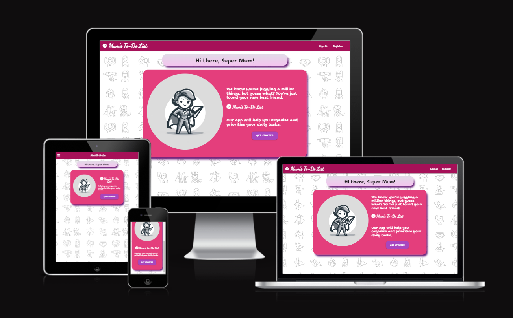
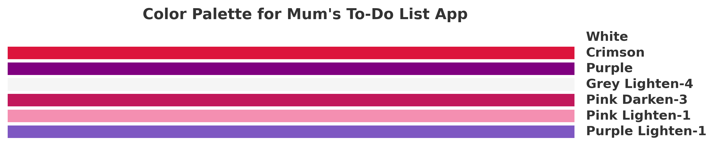
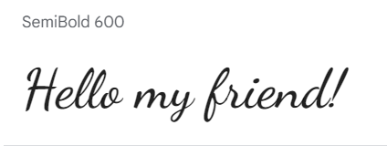
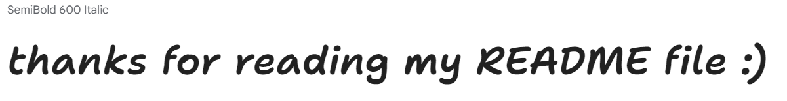
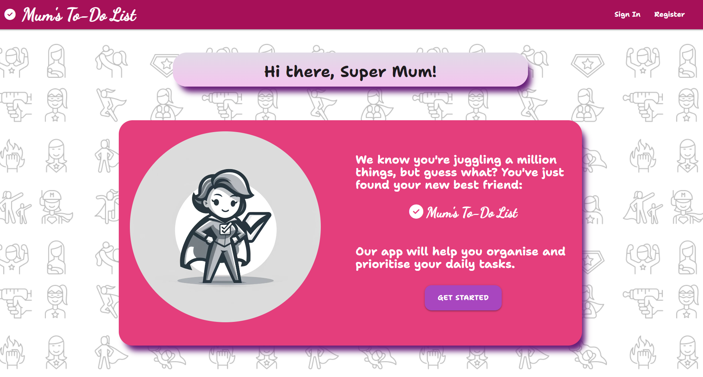
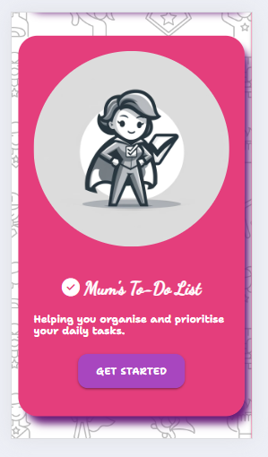
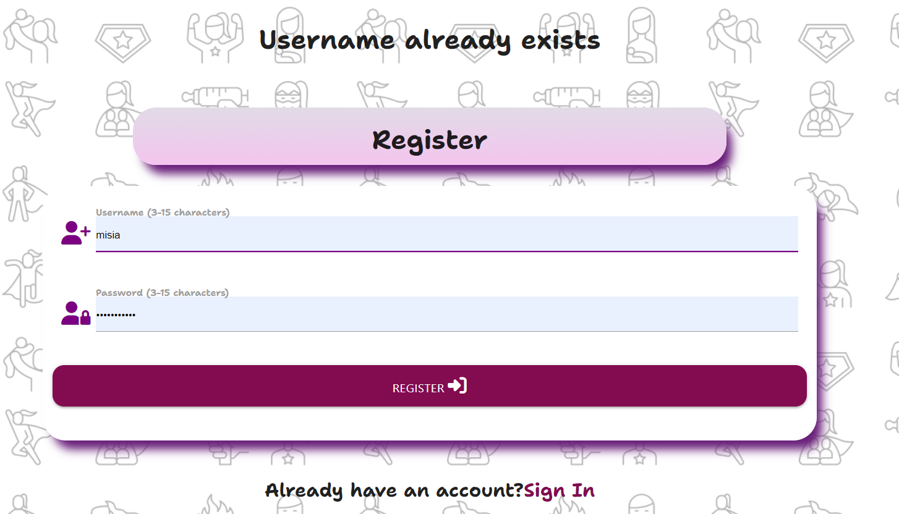
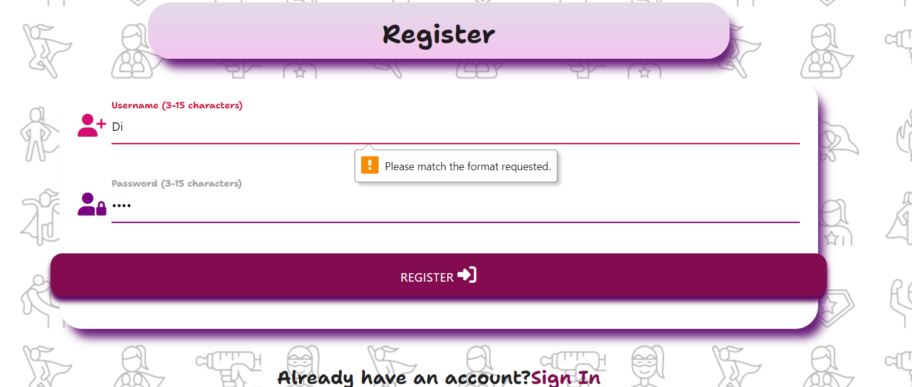
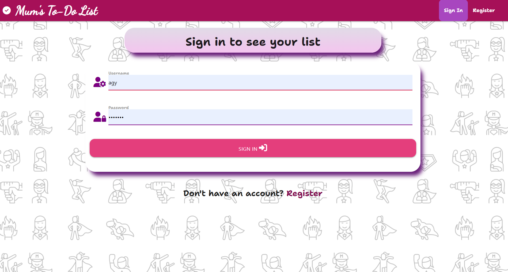
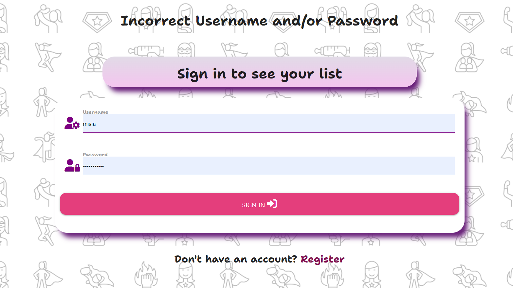

# **MUM'S TO-DO-LIST - 3rd milestone project**

## **Introduction**

 

Welcome to my third milestone project: Mum's To-Do List, This is a comprehensive Flask application for managing to-do items and categories aimed at busy mums. The application uses MongoDB as its database and includes a variety of features such as user authentication, adding, editing, and deleting to-do items and categories, as well as sorting and searching functionalities.

[Visit the website here](https://mums-to-do-list-64ef2a4f0d01.herokuapp.com/)

 

## **UX-User Experience Design**

 

## **Strategy Plane**

 

**The business goals for the website:**

1. To offer an easy and intuitive way for users to manage their daily tasks in a more organised and efficient manner.
2. To enhance user productivity by allowing users categorise to-do items, sort items and categories and set priorities.
3. Offer personalization and flexibility by allowing the users set their own categories.
4. Provide feedback to the users in a form of flash messages making the app more user friendly.
5. Encourage regural use by ensuring the app is easy and convenient to use.
6. Provide seamless cross-device experience by ensuring the website is responive and accessible on different devices.

 

**User stories:**

1. As a first-time visitor, I want to easily understand the purpose of the app.
2. As a first-time visitor, I want to be able to register and sign in into my own profile.
3. As a first-time and returning visitor, I want to stay signed-in to avoid frequent log-ins , but with a clear and accessible sign-out option for when I need to securely exit my profile.
4. As a first-time and returning visitor, I want to be able to easily navigate the app. I can access all the pages easily and go back to the my list quickly. 
5. As a first-time and returning visitor, I want to be able to add,edit and delete tasks and categories.
6. As a first-time and returning visitor, I want to be able to add details and due date to my tasks.
7. As a first-time and returning visitor, I want to be able to be able to prioritise tasks.
8. As a first-time and returning visitor, I want to be able to cross-out list items that are done and remove them from the list.
9. As a first-time and returning visitor, I want to be able to sort items on my list and categories as well.
10. As a first-time and returning visitor, I want to be able to use the app easily on different devices.
11. As a first-time and returning visitor, I want to receive immediate and clear feedback through notifications or messages within the app for various interactions, such as successfully adding, editing, or deleting tasks, errors, or confirmation prompts.
12.  As a first-time and returning visitor, I want to be able to search through to-do items and categories.
13. As an administrator, I want to be able to add and delete categories.

 

## **Scope Plane**

 

In order to achieve the strategy goals, the following features are included on the website:

- A  landing page with a welcome message at the top of the Home Page stating clearly stating the purpose of the app.
- A register and sign in page. Once users are signed it they are directed to their to-do list.
- A user stays signed it for 7 days to avoid frequent log-ins. There is a sign-out option which is easily accessible on each page.
- Navbar and footer links to navigate easily between the pages. 
- Adding, editing, and deleting options for to-do items and categories. Items on the list can be crossed out when done.
- Option to add details and the due date for each task
- An option to mark list items as important to allow prioritarization
- Sorting options both for to-do items and categories.
- Materialise.css classes and media queries were used to ensure responiveness on different devices
- Flash messages informing the user items and categories were successfully added, edited or deleted. Also users see a message when an item is crossed out as done.
- 404 and 500 pages with an option to go back to the list if there is an unexpected error.
- Search Box for searching items and categories.
- Administrator account with where categories can be added or deleted.

 

## **Structure Plane** 

 

The website consists of nine pages:
- **Landing Page**
- **Register Page**
- **Sign In Page**
- **My List Page**
- **Add New Item Page**
- **Edit Item Page**
- **Categories Page**
- **Add New Category Page**
- **Edit Category Page**

The navbar recurring on each page allows users to easily move between the pages. Once signed in the user has access to the links in the footer to additionally help navigate the site. 
I used a  favicon with a check icon in the address bar for every page to make it clear to users that they are still on the same website.  I used the same background image and consisten use of colours for different sections on each page to create a certain design pattern for the website. The Landing Page contains a short welcome message, a hero image and button links to Sign In Page. If a user is not registered yet, they will see a link to the registration page. After signing in, users are directed to My List Page where they can start adding items to their list. Categories Page diplays all categories. Users cannot change the existing categories (this is restricted for the administrator), but they can add new ones and delete the ones they created. I also added a **404** and **500 Error Pages** that direct users to the Home Page in case there is a problem with a link.

## **Surface Plane**

 

**Colour Scheme**

The selection of colors for Mum's to-do app was made with the intention of creating a visually appealing and user-friendly for busy mothers.  I chose Purple Lighten-1 (#7E57C2) and Pink Lighten-1 (#F48FB1)  to infuse a sense of warmth, positivity, and femininity into the app's design. The addition of Pink Darken-3 (#C2185B) provides a subtle contrast and was used as a background colour for the navbar. Grey Lighten-4 (#F5F5F5) offers a clean and neutral backdrop, enhancing readability and minimizing visual distractions.  Purple (#800080) and Crimson (#DC143C) were used in forms for focus in and focus out. The background is a repeatedimage representing a figure of a mum as a superhero who multitasks on an everyday basis. This is set against a white backdrop to ensure enough contrast and clarity. 

**Typography**

I used two fonts:

*Dancing Script* for the logo

and *Shantell Sans* for the rest of the body

*Dancing Script* was selected for the app's name because of its elegant and handwritten style. This font gives a sense of personal touch and warmth. On the other hand, *Shantell Sans* was chosen for the app's body text due to its clean and modern appearance. This sans-serif font ensures optimal readability and a straightforward user interface, making it easy for users to manage their to-do lists efficiently. The combination of *Dancing Script* and *Shantell Sans* strikes a balance between a friendly, inviting app name and a practical, user-centric body text.

 

## **Skeleton Plane**

 

[Wireframes](./docs/Mums_to_do_list_wireframes.pdf)

The website looks slightly different from what I initially had in mind when creating the wireframes. The landing page now has an image of a mum as a superhero. 'My List' items have an additional check button which can be used to cross out a item that has been done. Additionally, there is a 'delete all checked items' button which allows the users delete all items that have been crossed out. I used icons for all the buttons rather that words like 'save' or 'cancel' as shown in the wireframes. Categories section now includes 'edit' and 'delete' buttons only for categories created by a logged-in users. The four basic categories that are displayed to every user can only be managed by the adoministrator.

 

## **Feautures**

- **Landing Page**

The landing page serves as the first point of interaction for users, aimed at providing them with a clear understanding of what the app offers and how it can benefit them in their daily lives. The page starts with a welcoming and personalized heading, "Hi there, Super Mum!", immediately resonating with the target audience. Under the heading the page contains a card with a hero iage and a welcome message,
The image shows a mum portrayed as a superhero holding a to-do-list. It recognizes and celebrates the multifaceted roles and strengths of mothers. There are two versions of the welcome message – one for large screens and another for smaller displays.

 'Get Started' button encourage users to sign up and try the app.

 

- **Registration Page**

The registration page is simple and intuitive, ensuring a straightforward process for users. It features a clean and organized layout with clearly labeled input fields, reducing any potential confusion during the sign-up process.
Users are required to create a unique username, which must be 3-15 characters long. The input field is validated for length and character type (alphanumeric), enhancing both usability and security.

A password input field, also constrained to 3-15 characters and alphanumeric input, ensures that users create secure passwords.

The form includes client-side validation, ensuring that users fill out the form correctly before submission. This feature enhances user experience by providing immediate feedback on input errors. 

The form data is submitted using a POST method to the server, ensuring that user credentials are securely transmitted.

For users who already have an account, the page provides a direct link to the sign-in page. This thoughtful addition enhances user experience by facilitating easy navigation.

- **Sign-In Page**

The sign-in page features a clear and concise layout, making it easy for users to understand and use.
The heading "Sign in to see your list" is straightforward and indicates the purpose of the page directly.
 Users enter their username in a field with a minimum and maximum length requirement, ensuring consistency with the registration process.
 A separate field for the password enhances security. The password is also subject to length and character type restrictions.
The form uses the POST method to submit data, which helps in keeping user credentials secure. If the username or password are icorrect the users get feedback immediately.

If the username and the password are correct the user is taken to their To-Do-List Page.

For new users, the page provides a direct link to the registration page. This addition enhances user experience by facilitating easy navigation between signing in and registering.

## **Database Design**

I used a non-relational MongoDB database. The name of the database is **mums_to_do_list** and it consists of three collections:

- **categories**
    | Key | Type | Notes |
    | --- | --- | --- |
    | _id | ObjectId() | |
    | category_name | String | |
    | created_by | String | selected from **users** collection |

- **to_do_items**
    | Key | Type | Notes |
    | --- | --- | --- |
    | _id | ObjectId() | |
    | category_name | String | selected from **categories** collection |
    | to_do_item | String | |
    | item_details | String | |
    | is_important | String | |
    | due_date | String | |
    | created_by | String | |
    | is_crossed_out| Boolean | |
    

- **users**
    | Key | Type | Notes |
    | --- | --- | --- |
    | _id | ObjectId() | |
    | username | String | |
    | password | String | uses Secure Hash Algorithm (SHA) |

 

