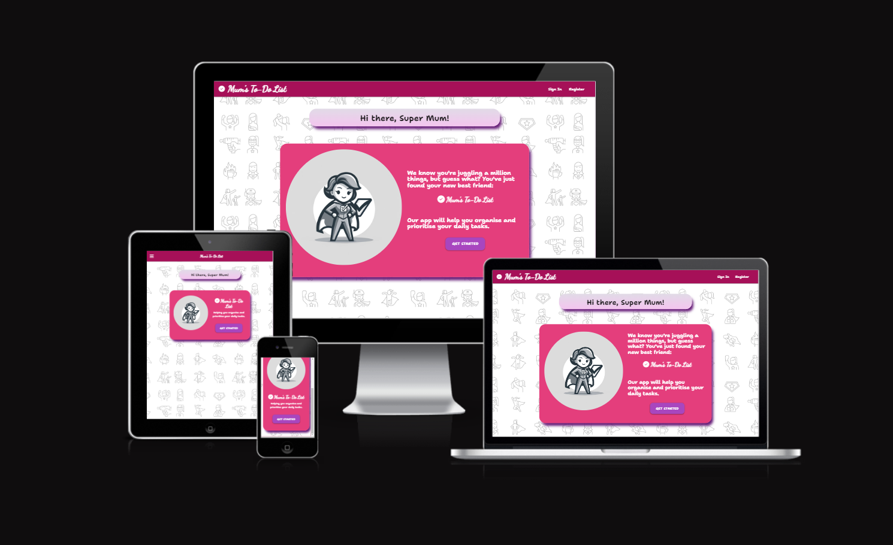

# **MUM'S TO-DO-LIST - 3rd milestone project**

 

## Table of contents

- [Introduction](#overview)
- [UX](#ux)
  - [Strategy Plane](#strategy-plane)
  - [Scope Plane](#scope-plane)
  - [Structure Plane](#structure-plane)
  - [Surface Plane](#surface-plane)
  - [Skeleton Plane](#skeleton-plane)
  - [Features](#features)
      - [Navigation Bar](#navigation-bar)
      - [Footer](#footer)
      - [Favicon](#favicon)
      - [Background image](#background-image)
      - [Landing Page](#landing-page)
      - [Registration Page](#registration-page)
      - [Sign In Page](#sign-in-page)
      - [CRUD funcionality](#crud-functionality)
      - [My List Page](#my-list-page)
      - [Add New Item Page](#add-new-item-page)
      - [Edit Item Page](#edit-item-page)
      - [Categories Page](#categories-page)
      - [Add Category Page](#add-category-page)
      - [Edit Category Page](#edit-category-page)
      - [Search Box](#search-box)
      - [Flash Messages](#flash-messages)
      - [Confirmation dialogs](#add-category-page)
      - [Admin account](#admin-account)
      - [Sign-Out Funcionality](#sign-out-functionality)
      - [404 and 500 Pages](#404-and-500-pages)
  - [Features to be incorporated in the future](#feautures-to-be-incorporated-in-the-future)
- [Defensive Mechanism](#defensive-mechanism)
- [Tools & technologies used](#tools-and-technologies-used)
- [Database Design](#data-and-design)
- [Testing](#testing)
- [Deployment](#deployment)
  - [MongoDB](#MongoDB)
  - [Heroku](#heroku)
  - [Local Deployment](#local-deployment) 
- [Credits](#credits)
  - [Code](#code)
  - [Content](#content)
- [Acknowledgements](#acknowledgements)

## **Introduction**

 

Welcome to my third milestone project: Mum's To-Do List, an application for managing to-do items and categories aimed at busy mums. It  is a user-friendly and efficient organisation tool developed using Flask, a Python web framework, and MongoDB for data storage. It features user authentication, enabling personalized task lists, and supports comprehensive task management capabilities, including adding, editing, prioritizing, and deleting tasks. The app offers dynamic sorting and searching, category management, and employs JavaScript for interactive user interface elements, enhancing the overall user experience. The To-Do List application also incorporates Materialize CSS, a modern responsive front-end framework based on Material Design principles, which significantly enhances the visual aesthetics and usability of the app, ensuring a smooth and engaging user experience across different devices and screen sizes.

[Visit the website here](https://mums-to-do-list-64ef2a4f0d01.herokuapp.com/)

 

## **UX-User Experience Design**

 

## **Strategy Plane**

 

**The business goals for the website:**

1. To offer an easy and intuitive way for users to manage their daily tasks in a more organised and efficient manner.
2. To enhance user productivity by allowing users categorise to-do items, sort items and categories and set priorities.
3. Offer personalization and flexibility by allowing the users set their own categories.
4. Provide feedback to the users in a form of flash messages making the app more user friendly.
5. Encourage regural use by ensuring the app is easy and convenient to use.
6. Provide seamless cross-device experience by ensuring the website is responive and accessible on different devices.

 

**User stories:**

1. As a first-time visitor, I want to easily understand the purpose of the app.
2. As a first-time visitor, I want to be able to register and sign in into my own profile.
3. As a first-time and returning visitor, I want to stay signed-in to avoid frequent log-ins , but with a clear and accessible sign-out option for when I need to securely exit my profile.
4. As a first-time and returning visitor, I want to be able to easily navigate the app. I can access all the pages easily and go back to the my list quickly. 
5. As a first-time and returning visitor, I want to be able to add,edit and delete tasks and categories.
6. As a first-time and returning visitor, I want to be able to add details and due date to my tasks.
7. As a first-time and returning visitor, I want to be able to be able to prioritise tasks.
8. As a first-time and returning visitor, I want to be able to cross-out list items that are done and remove them from the list.
9. As a first-time and returning visitor, I want to be able to sort items on my list and categories as well.
10. As a first-time and returning visitor, I want to be able to use the app easily on different devices.
11. As a first-time and returning visitor, I want to receive immediate and clear feedback through notifications or messages within the app for various interactions, such as successfully adding, editing, or deleting tasks, errors, or confirmation prompts.
12.  As a first-time and returning visitor, I want to be able to search through to-do items and categories.
13. As an administrator, I want to be able to add and delete categories.

 

## **Scope Plane**

 

In order to achieve the strategy goals, the following features are included on the website:

- A  landing page with a welcome message at the top of the Home Page stating clearly stating the purpose of the app.
- A register and sign in page. Once users are signed it they are directed to their to-do list.
- A user stays signed it for 7 days to avoid frequent log-ins. There is a sign-out option which is easily accessible on each page.
- Navbar and footer links to navigate easily between the pages. 
- Adding, editing, and deleting options for to-do items and categories. Items on the list can be crossed out when done.
- Option to add details and the due date for each task
- An option to mark list items as important to allow prioritarization
- Sorting options both for to-do items and categories.
- Materialise.css classes and media queries were used to ensure responiveness on different devices
- Flash messages informing the user items and categories were successfully added, edited or deleted. Also users see a message when an item is crossed out as done.
- 404 and 500 pages with an option to go back to the list if there is an unexpected error.
- Search Box for searching items and categories.
- Administrator account with where categories can be added or deleted.

 

## **Structure Plane** 

 

The website consists of nine pages:
- **Landing Page**
- **Register Page**
- **Sign In Page**
- **My List Page**
- **Add New Item Page**
- **Edit Item Page**
- **Categories Page**
- **Add New Category Page**
- **Edit Category Page**

The navbar recurring on each page allows users to easily move between the pages. Once signed in the user has access to the links in the footer to additionally help navigate the site. 
I used a  favicon with a check icon in the address bar for every page to make it clear to users that they are still on the same website.  I used the same background image and consisten use of colours for different sections on each page to create a certain design pattern for the website. The Landing Page contains a short welcome message, a hero image and button links to Sign In Page. If a user is not registered yet, they will see a link to the registration page. After signing in, users are directed to My List Page where they can start adding items to their list. Categories Page diplays all categories. Users cannot change the existing categories (this is restricted for the administrator), but they can add new ones and delete the ones they created. I also added a **404** and **500 Error Pages** that direct users to the Home Page in case there is a problem with a link.

## **Surface Plane**

 

**Colour Scheme**

The selection of colors for Mum's to-do app was made with the intention of creating a visually appealing and user-friendly for busy mothers.  I chose Purple Lighten-1 (#7E57C2) and Pink Lighten-1 (#F48FB1)  to infuse a sense of warmth, positivity, and femininity into the app's design. The addition of Pink Darken-3 (#C2185B) provides a subtle contrast and was used as a background colour for the navbar. Grey Lighten-4 (#F5F5F5) offers a clean and neutral backdrop, enhancing readability and minimizing visual distractions.  Purple (#800080) and Crimson (#DC143C) were used in forms for focus in and focus out. The background is a repeatedimage representing a figure of a mum as a superhero who multitasks on an everyday basis. This is set against a white backdrop to ensure enough contrast and clarity. 

**Typography**

I used two fonts:

*Dancing Script* for the logo

and *Shantell Sans* for the rest of the body

*Dancing Script* was selected for the app's name because of its elegant and handwritten style. This font gives a sense of personal touch and warmth. On the other hand, *Shantell Sans* was chosen for the app's body text due to its clean and modern appearance. This sans-serif font ensures optimal readability and a straightforward user interface, making it easy for users to manage their to-do lists efficiently. The combination of *Dancing Script* and *Shantell Sans* strikes a balance between a friendly, inviting app name and a practical, user-centric body text.

 

## **Skeleton Plane**

 

[Wireframes](./docs/Mums_to_do_list_wireframes.pdf)

The website looks slightly different from what I initially had in mind when creating the wireframes. The landing page now has an image of a mum as a superhero. 'My List' items have an additional check button which can be used to cross out a item that has been done. Additionally, there is a 'delete all checked items' button which allows the users delete all items that have been crossed out. I used icons for all the buttons rather that words like 'save' or 'cancel' as shown in the wireframes. Categories section now includes 'edit' and 'delete' buttons only for categories created by a logged-in users. The four basic categories that are displayed to every user can only be managed by the adoministrator.

 

## **Feautures**

- **Navigation Bar**

The navigation bar provides users with an intuitive and seamless navigation experience. It features a responsive design that adapts to both desktop and mobile devices, ensuring accessibility and ease of use for all users. Created with the Materialize CSS framework, the navigation bar highlights essential links and functionalities, including access to the user's to-do list, categories, and account management options such as signing in, registering, or signing out. 

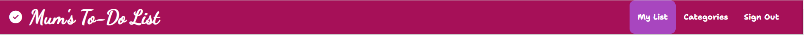

The navigation bar displays the app's logo and name, "Mum's To-Do List", anchored on the left side. This provides users with a consistent visual reference across the application. An icon (fa-solid fa-circle-check) next to the brand name enhances the visual appeal and is hidden on medium and smaller screens to maintain a clean look.

A side navigation is provided for mobile users, ensuring that navigation links remain accessible on smaller devices. This mobile navigation is triggered by a hamburger menu icon.

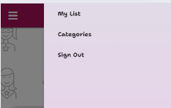

The navigation bar dynamically adjusts its links based on the user's authentication state. For logged-in users, links to "My List" and "Categories" are displayed, along with an option to "Sign Out". The current page or section is highlighted with an active class, providing users with visual feedback on their current location within the app.

- **Footer**

The footer is designed to offer logged in  users additional navigation options and functionalities related to the app. It's responsive design enhances the user's experience on various devices.

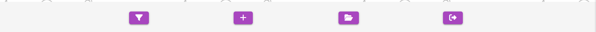

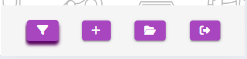

It consists of:

- Filter and Sort Button:

A button is provided to trigger a collapsible element, allowing users to filter and sort their to-do list items (or categories on categories pages). This feature enhances user engagement by providing a dynamic way to view their tasks.

- Collapsible Sort Options:

Upon clicking the filter button, users are presented with a collapsible list that offers sorting options ( e.g. alphabetically, or by importance). This allows for a customized viewing experience. (For more details on searching functionality read this section...)
Each option is a link that modifies the display of the to-do list according to the selected sort method.

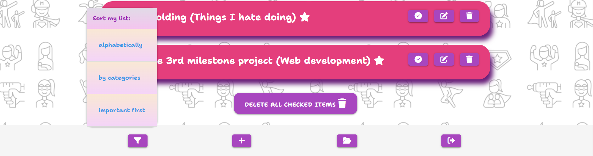

- Quick Access Icons:

Additional icons provide quick access to common tasks: adding new to-do items, managing categories, and signing out. Each action is represented by a distinct icon and is accompanied by visually hidden text for accessibility, ensuring users can navigate the app efficiently.

 

- **Favicon**

The favicon features a stylized check mark centered within a vibrant pink circle. I chose the check mark as it fits in the purpose of the app. The colour choice aligns with the app's branding.

 

- **Background image**

 The image contains a series of icons that depict different activities or roles, such as taking care of a child, cooking, shopping, and even superhero motifs, which reflect the multi-faceted role of a mother. A lighter opacity has been added to this image to create a pleasant backdrop without distracting from the app's content.

 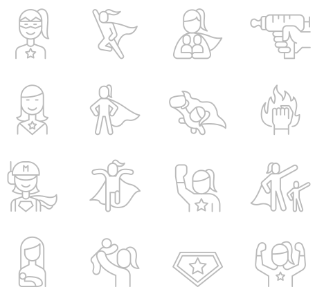

  

- **Landing Page**

The landing page serves as the first point of interaction for users, aimed at providing them with a clear understanding of what the app offers and how it can benefit them in their daily lives. The page starts with a welcoming and personalized heading, "Hi there, Super Mum!", immediately resonating with the target audience. Under the heading the page contains a card with a hero iage and a welcome message,
The image shows a mum portrayed as a superhero holding a to-do-list. It recognizes and celebrates the multifaceted roles and strengths of mothers. There are two versions of the welcome message – one for large screens and another for smaller displays.

 'Get Started' button encourages users to sign up and try the app.

 

- **Registration Page**

The registration page is simple and intuitive, ensuring a straightforward process for users. It features a clean and organized layout with clearly labeled input fields, reducing any potential confusion during the sign-up process.
Users are required to create a unique username, which must be 3-15 characters long. The input field is validated for length and character type (alphanumeric), enhancing both usability and security.

A password input field, also constrained to 3-15 characters and alphanumeric input, ensures that users create secure passwords.

The form includes client-side validation, ensuring that users fill out the form correctly before submission. This feature enhances user experience by providing immediate feedback on input errors. 

The form data is submitted using a POST method to the server, ensuring that user credentials are securely transmitted.

For users who already have an account, the page provides a direct link to the sign-in page. This thoughtful addition enhances user experience by facilitating easy navigation.

 

- **Sign-In Page**

The sign-in page features a clear and concise layout, making it easy for users to understand and use.
The heading "Sign in to see your list" is straightforward and indicates the purpose of the page directly.
 Users enter their username in a field with a minimum and maximum length requirement, ensuring consistency with the registration process.
 A separate field for the password enhances security. The password is also subject to length and character type restrictions.
The form uses the POST method to submit data, which helps in keeping user credentials secure. If the username or password are incorrect the users get feedback immediately.

If the username and the password are correct the user is taken to their To-Do-List Page. The user's username is stored in the session. Setting session.permanent = True makes the session persistent across browser sessions until explicitly logged out or session expires (session set for 7 days).

For new users, the page provides a direct link to the registration page. This addition enhances user experience by facilitating easy navigation between signing in and registering.

 

- **CRUD Functionality**

The application offers comprehensive CRUD (Create, Read, Update, Delete) functionality, enabling users to manage their to-do items and categories effectively. Users can create, view, edit and delete list items and categories.

- **My List Page**

The My List page serves as the primary interface for users to interact with their tasks. It is designed to offer a personalized and intuitive user experience where users can view, manage, and organize their to-do list efficiently.

The page greets users with a custom message, "{{ username }}'s list", creating a personalized space. A floating action button, styled distinctly, is provided for users to quickly add new tasks to their list.

Users can interact with their to-do items, which are displayed in an attractive card layout. Each card provides a visual summary of a task, including its name, associated category, and importance status marked by a star icon.

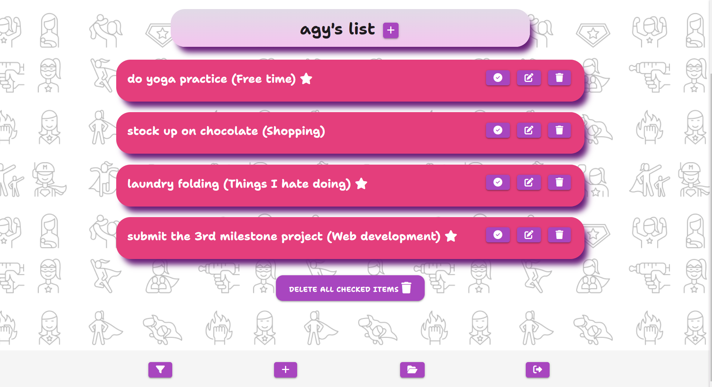

A card reveal feature is incorporated, which allows users to view additional details of each task, such as the due date and specific notes, by clicking on the task name.

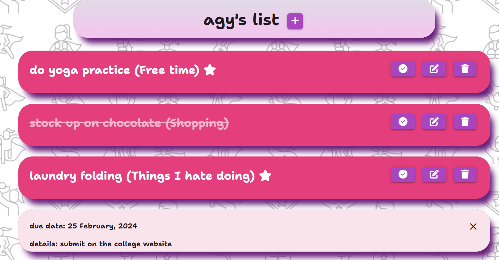

Tasks can be marked as completed, edited, or deleted directly from the card, offering users full control over their to-do list.

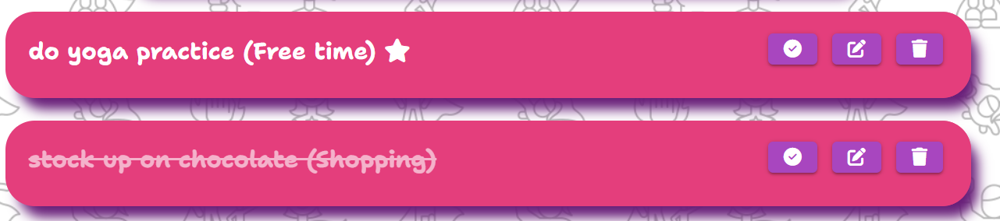

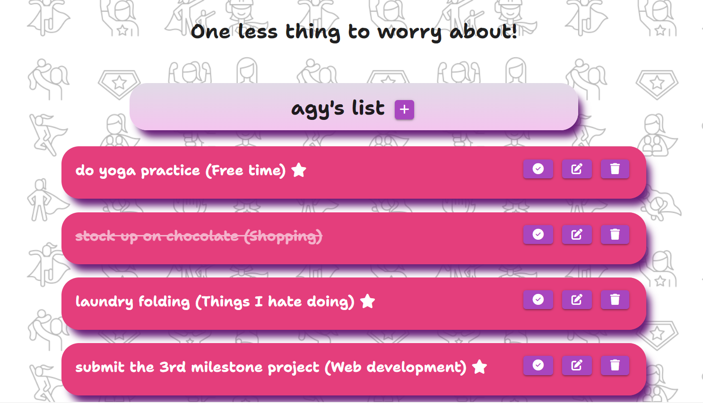

Users can perform bulk actions, such as deleting all completed tasks, with a single click. This feature simplifies list management and improves the user experience.

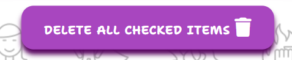

When all to-do items are deleted, users get a friendly, motivational message

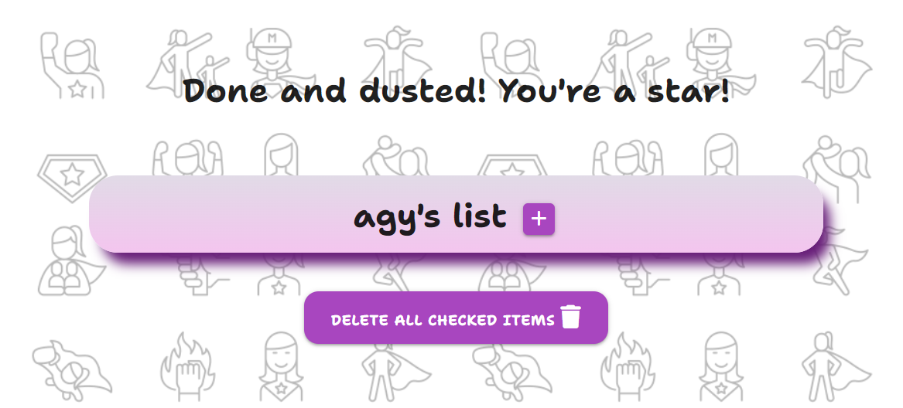

The footer contains an interactive button to  sort tasks, enabling users to customize how they view their list. Sorting options include alphabetical, by category, or by importance, allowing users to prioritize their tasks as needed.

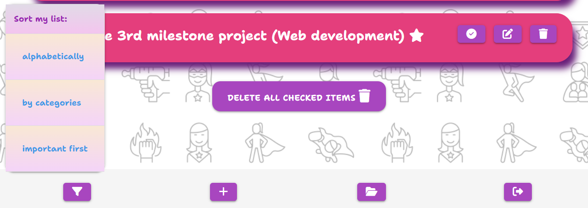

 

- **Add New Item Page**

The "Add New Item" allows users to insert new tasks into their to-do list. The page features a straightforward form wrapped within a Materialize CSS card panel, guiding users through the task creation process with clear input fields for task details.

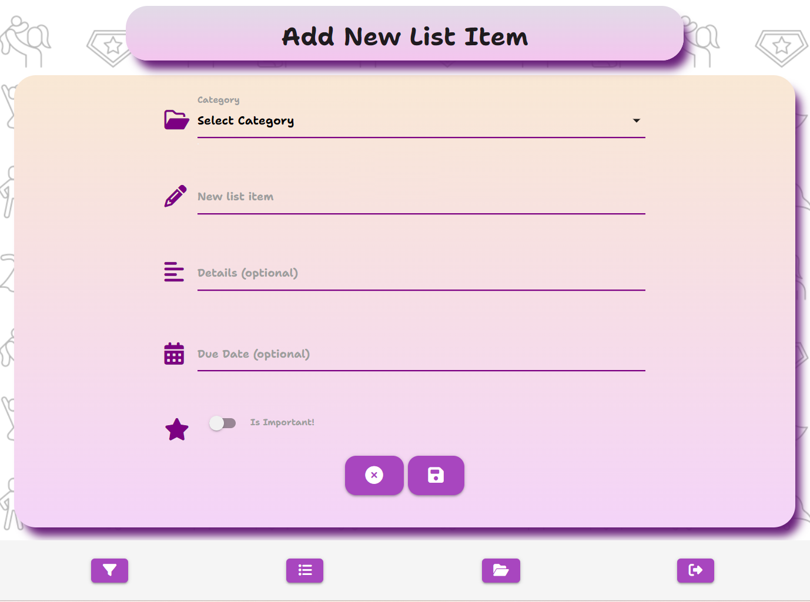

A dropdown menu is provided for users to categorize their new task, helping to keep the to-do list organized. Users can choose from a list that includes categories created by them or provided in the app.

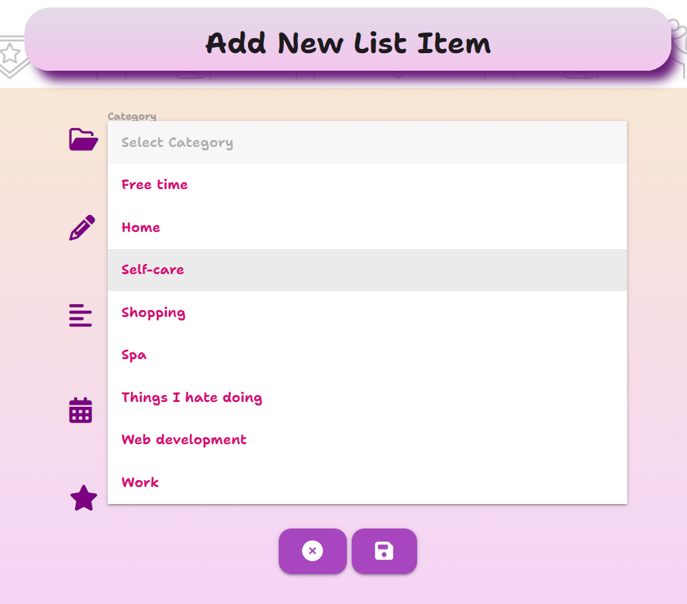

Users can enter the name of the new task, with validation rules ensuring that the input is within the specified character limits for optimal display and management. An additional text area is available for users to add more details to their tasks if they wish to do so.

The form includes a date picker for users to optionally set a due date for the task, integrating a calendar UI for easy date selection.

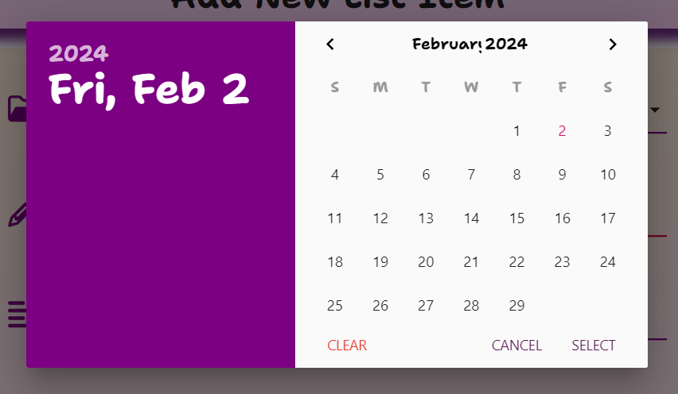

A switch is provided for users to mark tasks as important, visually represented by a star icon. This feature helps users prioritize their tasks.

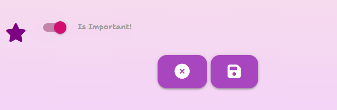

Two large, easy-to-identify buttons offer users the option to either save the new task or cancel the operation. The save button submits the form, while the cancel button redirects users back to their list without adding the new task.

 

- **Edit Item Page**

The Edit Item page allows users to make changes to existing tasks. All fields in the edit form are pre-filled with the existing details of the selected task. Users can see the current information and make necessary adjustments easily.

A dropdown menu populated with available categories allows users to re-categorize tasks if needed. Categories created by the user or an admin are included.

Users can edit the name and detailed description of the task and change the due date of the task.

A switch is available to mark the task as important, which can be toggled during the edit process. 

The form provides clear options to either save changes or cancel and return to the list. This ensures users have full control over the editing process and can opt-out at any moment.

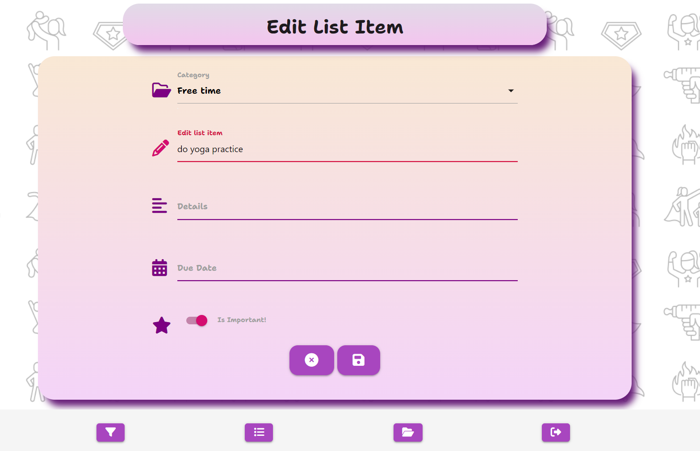

 

- **Categories Page**

This feature allows users to view, add, edit, and delete categories, providing a comprehensive toolset for category organization.
 A floating action button (+) is prominently displayed, enabling users to add new categories effortlessly. This button takes users to a dedicated form where they can enter the name of the new category.

 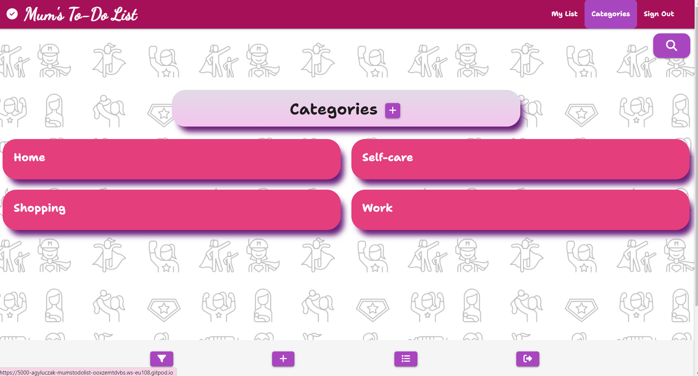

There are four categories provided in the app, but users can add their own. They can also edit and delete categories they created themselves. Editing and deletion capabilities are conditionally rendered based on the user's session information, ensuring that only authorized users can modify or remove categories. Editing and deleting the original categories is resrticted to the admin account.

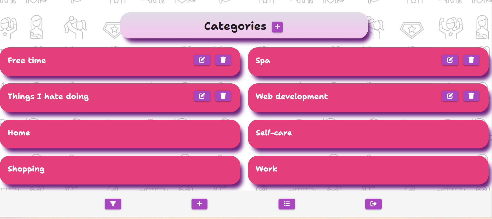

A collapsible filter button allows users to sort categories alphabetically or by those created by them first, offering enhanced navigation and personalization of the category viewing experience.

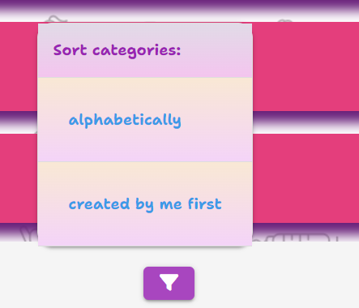

 

- **Add Category Page**

The "Add Category" feature enables users to create customized categories for their tasks. This functionality is designed to help users organize their tasks into meaningful groups, making task management more efficient and personalized. 

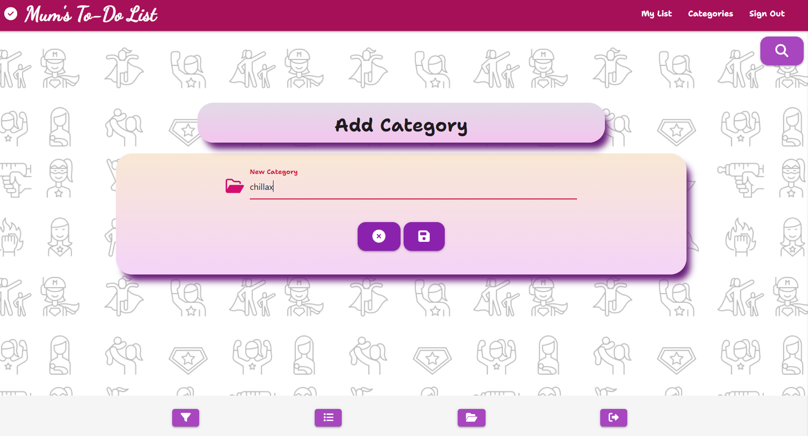

Users can easily add a new category through a simple form. This form includes an input field for the category name, ensuring a straightforward way to introduce new categories into their to-do list. The form validates user input to ensure that category names meet specific criteria (e.g., length between 3 to 20 characters).

Action buttons are provided to navigate away from the page without adding a new category or to submit the new category. 

 

- **Edit Category Page**

The "Edit Category" feature provides users with the flexibility to update the names of existing categories within the To-Do List application. The feature is accessed through an intuitive form that pre-populates the current category name, allowing users to easily see and modify the category's name.  To ensure data integrity, the form includes validation rules requiring category names to be within a specified length range. This validation prevents errors and promotes consistency in category naming conventions across the application.

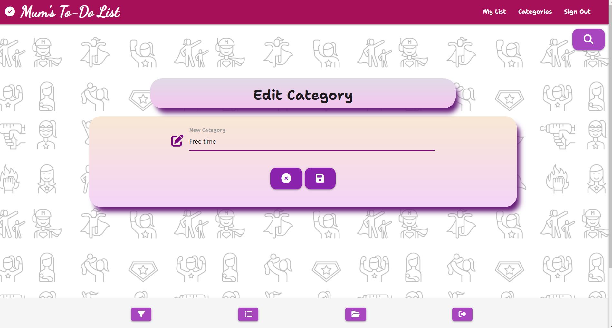

Alongside the form, action buttons enable users to either cancel the edit and return to the category overview or to save their changes. 

 

- **Search Box**

The search box  enables users to quickly locate specific items or categories within their to-do list. This feature is designed to provide an efficient and seamless user experience, allowing for immediate access to relevant tasks without the need to manually sift through the list. The search box is prominently placed within the application's interface, making it easily accessible for immediate use.

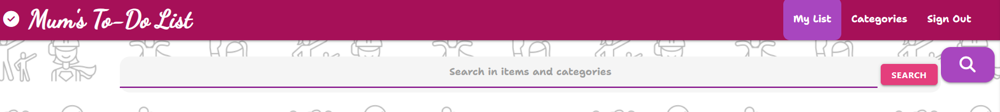

The search functionality is accessible to authenticated users. It ensures that users can only search within their own lists, maintaining privacy and security. Users can enter keywords related to the items or categories they are searching for. The system performs a comprehensive search across all to-do items, matching the entered keywords.
Upon submitting a search query, the application promptly displays the matched items. If no matches are found, the user is notified with a friendly message indicating the absence of matching items or categories.

 

- **Flash messages**

Flash messages are a crucial user feedback mechanism incorporated into the application. These messages provide immediate, contextual feedback to users following their actions within the app, such as adding, editing, or deleting to-do items and categories, signing in or out, and registering an account. 

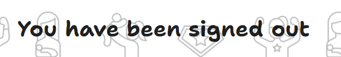

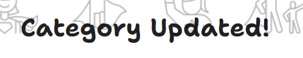

 

- **Confirmation dialogs**

JavaScript confirmation dialogs have been implemented to prevent accidental deletions. Before deleting any items or categories, users see a confirmation prompt asking them if they are sure they want to perform that action

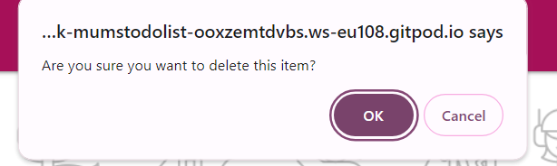

- **Admin account**

Right now the only additional privilage of the admin account is that it allows to create categories which will be seen by all users and delete any categories available. 

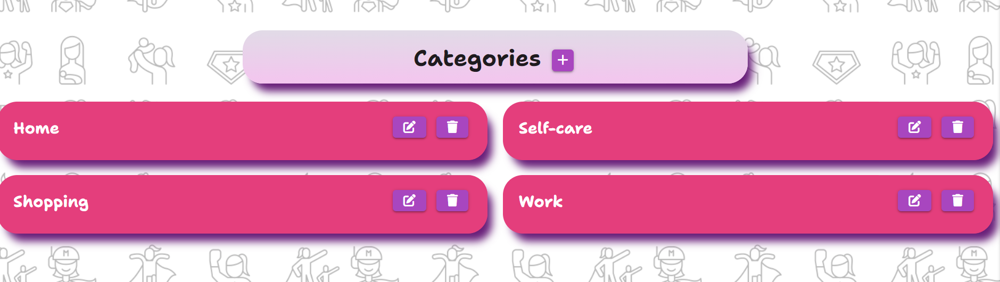

I'd like to expand the admin role in the future. More on that in the following section.

 

- **Sign-Out Funcionality**

The sign-out functionality enhances security and user control by allowing users to end their session. This feature is designed to ensure that once a user decides to log out, their session data is securely removed, preventing unauthorized access to their account, especially when using shared or public devices. Users can sign out whenever the want by clicking the link in the navbar or the footer.

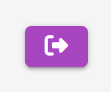

- **404 and 500 pages**

404 Error Page is designed to handle situations where a user attempts to access a page that cannot be found on the server. The page informs users in a friendly and clear manner that the page they are looking for does not exist. It also includes a "Go Back" button, directing users back to the main to-do list page.

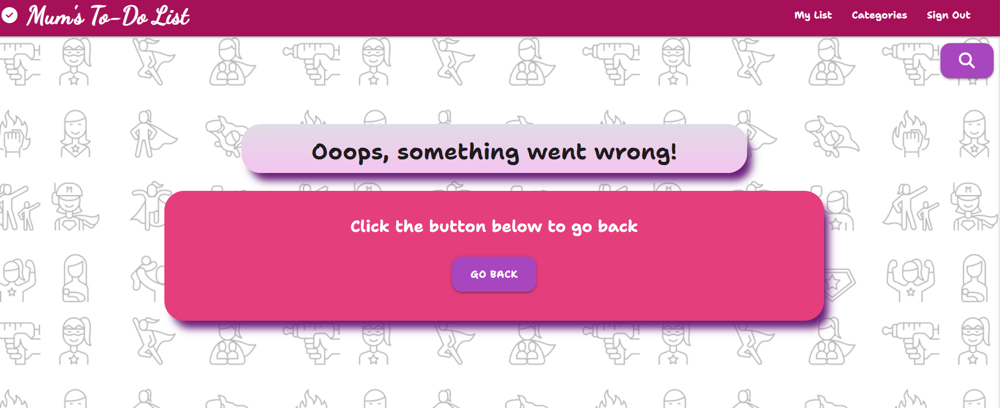

500 Error Page: Similarly, the 500 error page is set up to manage server-side errors effectively. Should there be an unexpected issue on our end, this page communicates to users that something went wrong on our side. Again a "Go Back" button, directs users back to the to-do list page.

## **Feautures to be icorporated in the future**

1. **Drag and drop** 
Improve Task Prioritization and Custom Sorting
by including drag-and-drop functionality for reordering tasks based on urgency, deadline, or personal preference, enabling users to manage their tasks more efficiently.

2. **Calendar Integration**
Incorporate a calendar view to allow users to visualize their tasks over a daily, weekly, or monthly calendar. This feature would help users plan their schedules more effectively by seeing at a glance when tasks are due or scheduled to be worked on.

3. **Recurring Tasks**
Allow users to set tasks as recurring, specifying the frequency (daily, weekly, monthly, etc.). This feature is particularly useful for tasks that need to be completed regularly, eliminating the need to manually create the same task multiple times.

4. **Sharing options**
Enable users to share lists or specific tasks with others.

5. **Notifications and Reminders**
Implement notifications and reminders that alert users of upcoming deadlines or when a task is due. These could be customizable and sent via email, SMS, or in-app notifications, helping users stay on top of their tasks without having to constantly check the app.

6. **Archive Page**
Allow users to archive items instead of deleting them to help them keep a record of all done items.

7. **Analytics and Progress Tracking**
Provide users with analytics and progress tracking features to monitor their productivity over time. This could include statistics on completed tasks, time spent on tasks, and trends in productivity, offering insights into how users can improve their time management.

8. **Expanded admin role**
Right now the administrator role is limited to managing the predefined categories. I want to extend it to tasks that users can select or be guided by. I also would like the administrator to be able to access the database and cancel deletion of any items or categories if requested by the user.

 

## Defensive mechanism

The application includes several defensive mechanisms to ensure security, data integrity, and proper user management. 

- **Environment Variables for Sensitive Information**
The app uses environment variables (os.environ.get("...")) for sensitive information like the MongoDB database name, URI, and the secret key. This practice keeps critical information out of the source code, reducing the risk of exposing sensitive data.

- **Password Hashing**
Passwords are not stored in plain text in the database. The app uses Werkzeug's generate_password_hash to hash passwords before storing them and check_password_hash to verify passwords during sign-in

- **User Session Management**
The app manages user sessions, allowing for persistent user sessions across web pages. It uses Flask's session object to store the username of the logged-in user.
Permanent Sessions with Expiry: By setting session.permanent = True and configuring PERMANENT_SESSION_LIFETIME, sessions are made permanent but with a controlled lifetime, enhancing both usability and security by automatically logging users out after a set period.

- **Input Validation and Sanitization**
Although not explicitly shown in the code snippets, the use of forms (e.g., request.form.get("username").lower()) implies that there's a degree of input validation, ensuring that data entered by users conforms to expected formats. Proper input validation and sanitization are crucial for preventing injection attacks and ensuring data integrity.

- **Authorization Checks**
The application performs checks to ensure that users are logged in before allowing access to certain pages or actions, such as adding or editing to-do items and categories. This is achieved through checks like if 'user' in session: before executing actions, ensuring that only authenticated users can perform sensitive operations.

- **Error Handling**
 Custom error handlers for common HTTP errors (404 and 500) enhance the user experience by providing friendly error pages. 

 

## Tools & Technologies Used

* [HTML](https://en.wikipedia.org/wiki/HTML) used for the main site content
* [CSS](https://en.wikipedia.org/wiki/CSS) used for the main site design and layout
* [JavaScript](https://en.wikipedia.org/wiki/JavaScript) used for user interaction on the site
* [Python](https://www.python.org) used as the back-end programming language
* [Flask](https://flask.palletsprojects.com) used as the Python framework for the site
* [Git](https://git-scm.com) used for version control (`git add`, `git commit`, `git push`)
* [GitHub](https://github.com) used for secure online code storage
* [Heroku](https://heroku.com) used for hosting the deployed back-end site
* [Gitpod](https://gitpod.io) used as a cloud-based IDE for the development
* [MongoDB](https://www.mongodb.com) used as the non-relational database management with Flask
* [Materialize](https://materializecss.com/) used as the front-end CSS framework for responsiveness and pre-built components
* [Font Awesome](https://fontawesome.com/) used to obtain the icons
* [Google Fonts](https://fonts.google.com/) used to obtain the fonts used in the project
* [Google Developer Tools](https://developers.google.com/web/tools/chrome-devtools) used as a primary method of finding bugs, and testing responsiveness across the project
* [Grammarly](https://www.grammarly.com/) used to check spelling and grammar errors across the project
* [W3C Markup Validation Service](https://validator.w3.org/) used to validate all HTML code written and used on this webpage
* [W3C CSS Validation Service](https://jigsaw.w3.org/css-validator/#validate_by_input) used to validate all CSS code written and used on this webpage
* [JSHint](https://jshint.com/) used to validate all JS code written and used on this webpage
* [PEP8 CI Python Linter](https://pep8ci.herokuapp.com) used to validate all of my Python files
* [AmIResponsive](http://ami.responsivedesign.is/) used to generate responsive images of the website
* [Balsamiq](https://balsamiq.com/wireframes) used to design the wireframes
* [Chat GPT4](https://https://chat.openai.com/) used to generate the image for the landing page and the colour palette. Also used along StackOverflow to look for possible causes of issues I came across while doing the project
* [Readme.so](https://readme.so) - Used to edit the readme file.
* [Tables generator](https://www.tablesgenerator.com/) - Used to create a table in readme file.
* [Befunky Photo Editor](https://befunky.com) - Used to resize and crop the images.
* [Style generator](https://html-css-js.com/) - Used for colour gradient, text-shadow and box-shadow.
* [Favicon generator](https://www.favicon-generator.org/) - Used to generate the website's favicon.

## **Database Design**

I used a non-relational MongoDB database. The name of the database is **mums_to_do_list** and it consists of three collections:

- **categories**
    | Key | Type | Notes |
    | --- | --- | --- |
    | _id | ObjectId() | |
    | category_name | String | |
    | created_by | String | selected from **users** collection |

- **to_do_items**
    | Key | Type | Notes |
    | --- | --- | --- |
    | _id | ObjectId() | |
    | category_name | String | selected from **categories** collection |
    | to_do_item | String | |
    | item_details | String | |
    | is_important | String | |
    | due_date | String | |
    | created_by | String | |
    | is_crossed_out| Boolean | |
    

- **users**
    | Key | Type | Notes |
    | --- | --- | --- |
    | _id | ObjectId() | |
    | username | String | |
    | password | String | uses Secure Hash Algorithm (SHA) |

 

# Testing

Please go to [TESTING.md](TESTING.md) file to see the tesing section.

 

## Deployment

The live deployed application can be found deployed on [Heroku](https://mums-to-do-list-64ef2a4f0d01.herokuapp.com/).

### MongoDB Non-Relational Database

This project uses [MongoDB](https://www.mongodb.com) for the Non-Relational Database.

To obtain your own MongoDB Database URI, sign up on their site, then follow these steps:

* The name of the database on MongoDB should be called **insert-your-database-name-here**
* The collection(s) needed for this database should be **insert-your-collection-names-here**
* Click on the **Cluster** name created for the project
* Click on the **Connect** button
* Click **Connect Your Application**
* Copy the connection string, and replace `password` with your own password (also remove the angle brackets)

## Heroku Deployment

This project uses [Heroku](https://www.heroku.com), a platform as a service (PaaS) that enables developers to build, run, and operate applications entirely in the cloud.

After setting up an account, follow these steps for deployment:

* Select **New** in the top-right corner of your Heroku Dashboard, and select **Create new app** from the dropdown menu
* Your app name must be unique, and then choose a region closest to you (EU or USA), and finally, select **Create App**
* From the new app **Settings**, click **Reveal Config Vars**, and set your environment variables

| Key | Value |
| --- | --- |
| `DATABASE_URL` | user's own value |
| `IP` | 0.0.0.0 |
| `MONGO_DBNAME` | user's own value |
| `MONGO_URI` | user's own value |
| `PORT` | 5000 |
| `SECRET_KEY` | user's own value |

Heroku needs two additional files to deploy properly:

* requirements.txt
* Procfile

You can install this project's **requirements** (where applicable) using:

* `pip3 install -r requirements.txt`

If you have your own packages that have been installed, then the requirements file needs updated using:

* `pip3 freeze --local > requirements.txt`

The **Procfile** can be created with the following command:

* `echo web: python app.py > Procfile`
* *replace **app.py** with the name of your primary Flask app name; the one at the root-level*

For Heroku deployment, follow these steps to connect your own GitHub repository to the newly created app:

You can select **Automatic Deployment** from the Heroku app

Or:

* In the Terminal/CLI, connect to Heroku using this command: `heroku login -i`
* Set the remote for Heroku: `heroku git:remote -a app_name` (replace *app_name* with your app name)
* After performing the standard Git `add`, `commit`, and `push` to GitHub, you can now type:
  * `git push heroku main`

The project should now be deployed to Heroku.

### Local Deployment

This project can be cloned or forked to make a local copy on your own system.

For either method, you will need to install any applicable packages found within the *requirements.txt* file:

* `pip3 install -r requirements.txt`

#### Cloning

You can clone the repository by following these steps:

1. Go to the [GitHub repository](https://github.com/AgyLuczak/MUM-S-TO-DO-LIST)
2. Find the 'Code' button above the list of files and click it
3. Select if you prefer to clone using HTTPS, SSH, or GitHub CLI and click the copy button to copy the URL to your clipboard
4. Open Git shell or Terminal
5. Change the current working directory to the one where you want the cloned directory
6. In your IDE Terminal, type the following command to clone my repository:
	* `git clone https://github.com/AgyLuczak/MUM-S-TO-DO-LIST.git`
7. Press Enter to create your local clone

#### Forking

By forking the GitHub Repository, we make a copy of the original repository on our GitHub account to view and/or make changes without affecting the original owner's repository.
You can fork this repository by using the following steps:

1. Log in to GitHub and locate the [GitHub Repository](https://github.com/AgyLuczak/MUM-S-TO-DO-LIST)
2. Find the 'Fork' button at the top of the repository and click it.
3. Once clicked, you should now have a copy of the original repository in your own GitHub account.

## **Credits** ##

 

**Code**

- [W3Schools](https://www.w3schools.com/) - general source of reference

- [Python Documentation](https://docs.python.org//) - general source of reference

- 'Python Crash Course' by Eric Matthes - general source of reference

- [Stackoverflow](https://stackoverflow.com/) - suggestions for solutions for various problems while doing the project

- [ChatGPT4](https:https://chat.openai.com/) - used along Stackoverlow for solutions for various problems encountered while doing the project

- My tutor Ashley Oliver and my mentor Rory Patrick Sheridan - various suggestions for improving the project

- My classmate Adam White for a number of suggestions for solving some of the issues in the project

 
 
**Content**

[ShutterStock](https://shutterstock.com/) - Source of the background image

[ChatGPT4](https://chat.openai.com/) - used to generate the hero image for the landing page and the color palette

 

 ## Acknowledgements

  

I would like to say a massive thank you to:
 
 - my course mentor Rory Patrick Sheridan and my tutor Ashley Oliver for their help and support during the project

 - my classmates Adam White and Jacob Bulejcik for their valuable feedback 

 - my husband Gniewomir for his incredible support since the beginning of the course.

