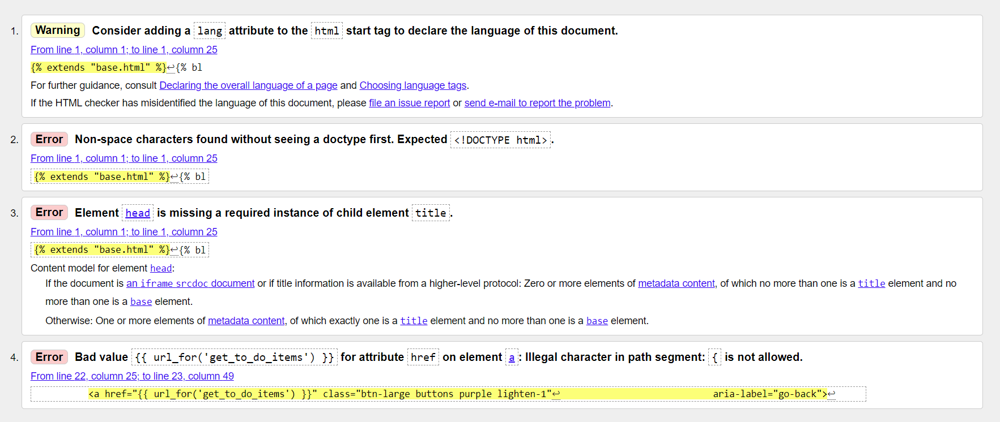
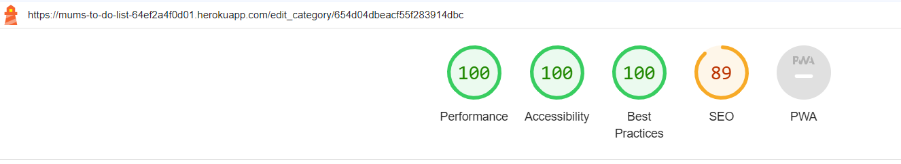

Go back to the [README.md](README.md) file

## **Testing**

### User Stories

 
 
| USER STORY  |  TESTING |
|---          |---       |
| As a first-time visitor, I want to easily understand the purpose of the app. |  <ul><li> App name clearly states what it is - a to-do list for mums</li> <li> Landing Page - provides users with a clear understanding of what the app offers</li></ul>|
|As a first-time visitor, I want to be able to register and sign in to my profile. | <ul><li> Users need to register first to start creating their list in their accounts. The Registration Page provides a simple registration form with clearly labeled input fields.</li><li>Sign-In Page allows registered users access their accounts. Users are provided with a simple form with clear input fields for their username and password. After signing in, they are directed to their list.|</li></ul>
|  As a first-time and returning visitor, I want to stay signed in to avoid frequent log-ins , but with a clear and accessible sign-out option for when I need to exit my profile securely.  | <ul><li> The user's username is stored in the session for 7 days.</li><li>Users can easily find a sign-out option on each page either in the navbar or in the footer.|</li>
|  As a first-time and returning visitor, I want to navigate the app easily the app. I can access all the pages easily and go back to my list quickly.            | <ul><li> The navigation bar is provided at the top of the page. Users can navigate the app easily on different devices. </li><li> The footer offers additional navigation options, allowing to access the required pages</li><li>Both the navigation bar and the footer have clear links to the My List Page allowing the user to access it quickly</li>|
| As a first-time and returning visitor, I want to be able to add, edit and delete tasks and categories.            |<li>CRUD(Create, Read, Update, Delete) operations have been implemented in the app</li><li>Users can easily find the right action buttons to add, edit, and delete tasks and categories</li>|
| As a first-time and returning visitor, I want to be able to add details and due dates to my tasks.            |<li>When users add a new list item, they can use a date picker to set a due date for their task</li>  |
| As a first-time and returning visitor, I want to be able to prioritize tasks.            |<li> Users can mark a list item as important using a switch in the form for creating new tasks. This will then display a star icon next to the tasks marked as important</li><li> Users can use one of the sorting options to display the important tasks first to prioritize them</li> |
| As a first-time and returning visitor, I want to be able to cross out list items that are done and remove them from the list.            |<li>Tasks can be marked as completed by pressing the check button. The item will be then crossed out</li></li><li>Users can delete single items or perform a bulk action and delete all checked items using an action button placed below their to-do list</li>   |
| As a first-time and returning visitor, I want to be able to sort items on my list and categories as well.           |<li>On the My List Page the footer contains an interactive button to sort list items. Sorting options include alphabetical, by category or by importance<li>On the Categories Page the footer also contains a button for sorting. Here the sorting options include alphabetical and 'created by me first'.    |
| As a first-time and returning visitor, I want to be able to use the app easily on different devices.            | <li>Materialize CSS framework was used to create this app. It uses a flexible grid system, making layout responsive by default. This system ensures that your website’s content  maintains its integrity across devices</li><li>Additionally, CSS media queries have been used to ensure responsiveness on different screen sizes |
|  As a first-time and returning visitor, I want to receive immediate and clear feedback through notifications or messages within the app for various interactions, such as successfully adding, editing, or deleting tasks, errors, or confirmation prompts.           |<li> Flash messages provide immediate feedback to users following their actions within the app</li><li> JavaScript confirmation dialogs have been implemented to prevent accidental deletions. Before deleting any items or categories, users see a confirmation prompt asking them if they are sure they want to perform that action</li>|
|  As a first-time and returning visitor, I want to be able to search through to-do items and categories           | <li> The search box ,prominently placed within the application's interface, enables users find specific items or categories within their to-do list</li>  |
| As an administrator, I want to be able to add and delete categories.            | <li> The categories displayed to all users can only be added and deleted by the admin account</li> |

### CRUD Testing

|CRUD   | ACTION  |  RESULT |
|---|---|---|
| **CREATE** |<li>**Adding New To-Do Items**: Users can add new to-do items through a form. Each item can include details such as the item name, category, importance, due date, and additional details</li><li>**Adding New Categories**: Users have the ability to create categories</li> | PASS  |
| **READ**  | <li>**Displaying To-Do Items**: The application lists all to-do items created by the logged-in user. Users can view their tasks, along with relevant details such as category, importance, and due date</li><li>**Viewing Categories**: Users can view all categories, including those created by them and default categories provided by the application |  PASS |
| **UPDATE**  | <li> **Editing To-Do Items**: Users can edit their to-do items to update any details, including the item name, category, importance, due date, and additional details</li><li>**Modifying Categories**: Users can also edit categories to update their names |  PASS |
| **DELETE**  |<li> **Deleting To-Do Items**: Users can delete individual to-do items. Before deletion, a confirmation prompt ensures that the user does not accidentally remove an item </li><li> **Removing Categories**: Categories can be deleted. The application asks for confirmation to prevent unintentional deletion of categories</li><li>**Bulk Deletion**: Users can mark multiple to-do items as completed (or crossed out) and then opt to delete all checked items in one action</li>| PASS  |

 

### Database Testing

| ACTION  |   RESULT |
|---|---|
|Create a new user account and verify its presence in the user collection in MongoDB  | PASS  |
|Create a new list item to check its presence in the to_do_items collection in MongoDB  | PASS  |
|Edit a to-do list item and confirm the accurate changes in the to_do_items collection of MongoDB | PASS  |
|Mark an item as done by pressing the check button and confirm the change in  to_do_items collection (is_crossed_out: true)  | PASS  |
|Delete a list item and verify the successful removal from the to_do_items collection in MongoDB  | PASS  |
|Delete all checked items and verify their successful removal from the to_do_items collection in MongoDB   | PASS  |
|Create a new category tand check its presence in the categories collection in MongoDB   | PASS  |
|Edit a category and confirm the accurate changes in the categories collection of MongoDB  | PASS  |
|Delete a category and verify the successful removal from the categories collection in MongoDB   | PASS  |

 

### Code Validation

- [W3C Markup Validator](https://validator.w3.org/)

I used W3C Validator to test all HTML pages. Initially, the validator showed a few unclosed or stray tags and a nesting issue with a paragraph under <h5> tag on a landing page. The remaining errors are a result of using a Jinja template.

| PAGE  | SCREENSHOTS  |
|---|---|
| Landing Page  |   |
| Register  |    |
| Sign In  |    |
| My List  |    |
| Add New Item  |    |
| Edit Item  |   |
| Categories  |    |
| Add Category  |    |
| Edit Category  |   |
| 404  |   |
| 500  |   |

 

- [W3C CSS Validator](https://jigsaw.w3.org/css-validator/)

I used W3C CSS Validator for the CSS. Initial results showed errors around the 'progid' property. This one is a part of the code pasted from the gradient generator. After removing that property, the only error flagged by the validator is that the property 'font-display' does not exist. It is however a valid property, which either indicates that the validation tool is outdated or does not recognise this value in the particular context it's been used in.

|  INITIAL RESULT | FINAL RESULT  |
|---|---|
|   |   |

 

### Python and Jinja Syntax

- [PEP8 CI Python Linter](https://pep8ci.herokuapp.com/)

I have used the PEP8 CI Python Linter application to test my Python and Jinja syntax. The initial results showed a lot of white space and lines of code that were too long. After formatting the code, the validation still flagged some lines as too long. I decided to leave them in their original format as breaking them down could harm the clarity of the code.

|  INITIAL RESULT | FINAL RESULT  |
|---|---|
|  |   |

 

### Lighthouse

|  PAGE | DESKTOP  | MOBILE  |
|---|---|---|
|  Landing Page |   |    |
| Register  |    |    |
| Sign In  |    |    |
| My List  |   |   |
| Add New Item  |   |   |
| Edit Item  |   |    |
| Categories  |   |   |
| Add Category  | |   |
| Edit Category  |  |   |