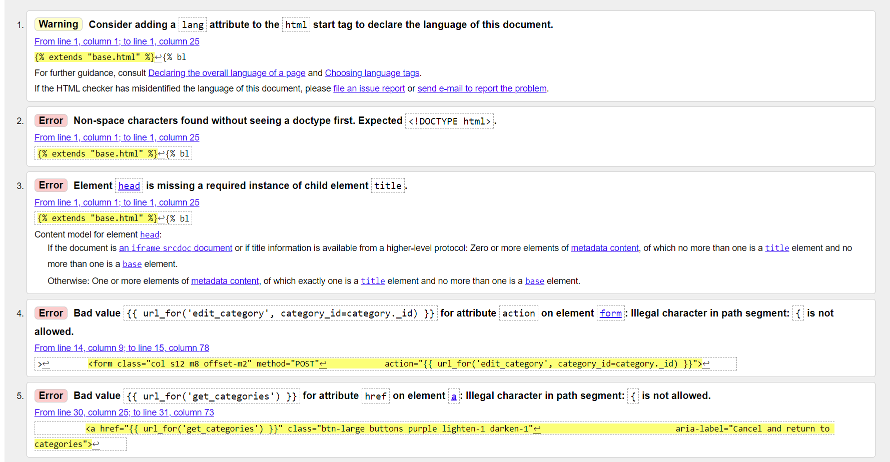

Go back to the [README.md](README.md) file

# **Testing**

A key focus of our testing methodology was to cover various aspects of the application, including code validation, functionality, usability, responsiveness, database integrity, performance, and accessibility. This approach ensured that the application was tested from multiple angles.

 

## Testing section table of contents 

- [Methods Used](#methods-used)
- [Code Validation](#code-validation)
    - [HTML](#HTML)
    - [CSS](#CSS)
    - [Python and Jinja Syntax](#python-and-jinja-syntax)
    - [Java Script](#java-script)
- [Responsiveness](#responsiveness)
- [Lighthouse](#lighthouse)
- [WAVE](#wave-web-accessibility-evaluation-tool)
- [Manual Testing](#manual-testing)
    - [User Stories](#user-stories)
    - [Full Testing](#full-testing)
    - [CRUD Testing Focus](#crud-testing-focus)
    - [Datbase Testing](#database-testing)
- [Known Bugs and Fixes](#known-bugs-and-fixes)
- [Other issues noticed in full manual testing](#other-issues)

 

### Methods Used

**Code Validation:**

HTML and CSS: Utilizing tools like the W3C Markup and CSS Validators ensured that the application's frontend code adhered to web standards, thus enhancing compatibility and performance across different web browsers.
Python and Jinja Syntax: The PEP8 CI Python Linter was used to ensure coding standards for the backend were followed.

**Manual Testing:**

A detailed manual testing process was undertaken, covering functional testing to validate the application's operations, usability testing based on user stories to ensure a positive user experience, and responsive design testing to guarantee accessibility across various devices.

**Database Testing:**

Manual verification within the MongoDB database confirmed that the application's CRUD operations were accurately reflected in the database, ensuring data integrity and consistency.

**Performance and Accessibility Testing:**

Tools like Google's Lighthouse provided insights into the application's performance, accessibility, best practices, and search engine optimization, highlighting areas for improvement and ensuring compliance with modern web standards.

**Methods Not Used and Potential Consequences**

The decision to omit certain testing methods, such as automated testing, security testing, and load testing, was made considering the project's scope and resource availability. However, the absence of these testing methods could lead to potential challenges, such as missed bugs, security vulnerabilities, and performance issues under high traffic conditions.

 

### Code Validation

- [W3C Markup Validator](https://validator.w3.org/)

I used W3C Validator to test all HTML pages. Initially, the validator showed a few unclosed or stray tags and a nesting issue with a paragraph under the `<h5>` tag on a landing page. The remaining errors are a result of using a Jinja template.

| **PAGE**  | **SCREENSHOTS**  |
|---|---|
| Landing Page  |   |
| Register  |    |
| Sign In  |    |
| My List  |    |
| Add New Item  |    |
| Edit Item  |   |
| Categories  |    |
| Add Category  |    |
| Edit Category  |   |
| 404  |   |
| 500  |   |

 

### CSS

- [W3C CSS Validator](https://jigsaw.w3.org/css-validator/)

I used W3C CSS Validator for the CSS. Initial results showed errors around the 'progid' property. This one is a part of the code pasted from the gradient generator. After removing that property, the only error flagged by the validator is that the property 'font-display' does not exist. It is however a valid property, which either indicates that the validation tool is outdated or does not recognise this value in the particular context it's been used in.

|  **INITIAL RESULT** | **FINAL RESULT**  |
|---|---|
|   |   |

 

### Python and Jinja Syntax

- [PEP8 CI Python Linter](https://pep8ci.herokuapp.com/)

I have used the PEP8 CI Python Linter application to test my Python and Jinja syntax. The initial results showed a lot of white space and lines of code that were too long. After formatting the code, the validation still flagged some lines as too long. I decided to leave them in their original format as breaking them down could harm the clarity of the code.

|  **INITIAL RESULT** | **FINAL RESULT**  |
|---|---|
|  |   |

 

### Java Script

- [JS hint Validator](https://https://jshint.com/)

I have used the JS Hint validator for the Java Script syntax. The results showed unused Variables (confirmDeleteItem, confirmDeleteAllChecked, confirmDeleteCategory, toggleSearch).  These variables are  not called within the JavaScript file, however they are referenced in the HTML files.

 

### RESPONSIVENESS

**I used Chrome Developer tools to simulate the following devices:**
- iphone SE
- iphone XR
- iphone 12 Pro
- Pixel 5
- Samsung Galaxy S8+
- Samsung Galaxy S20 Ultra
- iPad Air 
- iPad Mini
- Surface Pro7
- Galaxy Fold 
- Samsung Galaxy A51/71
- Nest Hub 
- Nest Hub Max

The website was responsive on all these devices.

 

### Lighthouse

The initial results were showing lower results for accessibility (86)and SEO sections (84) This has been improved by adding aria labels and visually hidden class to all the buttons and meta description to the head element.

|**PAGE** | **DESKTOP**  | **MOBILE**  |
|---|---|---|
|  Landing Page |   |    |
| Register  |    |    |
| Sign In  |    |    |
| My List  |   |   |
| Add New Item  |   |   |
| Edit Item  |   |    |
| Categories  |   |   |
| Add Category  | |   |
| Edit Category  |  |   |

The SEO results are still below 90. The remaining flagged issues are:

- Links are not crawlable (showed one element in Materialize framework a.sidenav-trigger)
- Web app manifest or service worker do not meet the installability requirements
- Is not configured for a custom splash screenFailures: No manifest was fetched.
- Does not set a theme color for the address bar.Failures: No manifest was fetched, No `<meta name="theme-color">` tag found.
- Content is sized correctly for the viewport
- Manifest doesn't have a maskable iconNo manifest was fetched

 

### WAVE (Web Accessibility Evaluation Tool)

I used WAVE to test the website's accessibility. The initial results flagged up low contrast on cards. I made the colour of the cards slightly darker, increasing the contrast and thus improving accessibility

|  **INITIAL RESULT** | **FINAL RESULT**  |
|---|---|
|  |   |

## Manual Testing

### User Stories

 
 
| **USER STORY**  |  **TESTING** |
|---          |---       |
| As a first-time visitor, I want to easily understand the purpose of the app. |  <ul><li> App name clearly states what it is - a to-do list for mums</li> <li> Landing Page - provides users with a clear understanding of what the app offers</li></ul>|
|As a first-time visitor, I want to be able to register and sign in to my profile. | <ul><li> Users need to register first to start creating their list in their accounts. The Registration Page provides a simple registration form with clearly labeled input fields.</li><li>Sign-In Page allows registered users access their accounts. Users are provided with a simple form with clear input fields for their username and password. After signing in, they are directed to their list.|</li></ul>
|  As a first-time and returning visitor, I want to stay signed in to avoid frequent log-ins , but with a clear and accessible sign-out option for when I need to exit my profile securely.  | <ul><li> The user's username is stored in the session for 7 days.</li><li>Users can easily find a sign-out option on each page either in the navbar or in the footer.|</li>
|  As a first-time and returning visitor, I want to navigate the app easily the app. I can access all the pages easily and return to my list quickly.            | <ul><li> The navigation bar is provided at the top of the page. Users can navigate the app easily on different devices. </li><li> The footer offers additional navigation options, allowing to access the required pages</li><li>Both the navigation bar and the footer have clear links to the My List Page allowing the user to access it quickly</li>|
| As a first-time and returning visitor, I want to be able to add, edit and delete tasks and categories.            |<li>CRUD(Create, Read, Update, Delete) operations have been implemented in the app</li><li>Users can easily find the right action buttons to add, edit, and delete tasks and categories</li>|
| As a first-time and returning visitor, I want to be able to add details and due dates to my tasks.            |<li>When users add a new list item, they can use a date picker to set a due date for their task</li>  |
| As a first-time and returning visitor, I want to be able to prioritize tasks.            |<li> Users can mark a list item as important using a switch in the form for creating new tasks. This will then display a star icon next to the tasks marked as important</li><li> Users can use one of the sorting options to display the important tasks first to prioritize them</li> |
| As a first-time and returning visitor, I want to be able to cross out list items that are done and remove them from the list.            |<li>Tasks can be marked as completed by pressing the check button. The item will be then crossed out</li></li><li>Users can delete single items or perform a bulk action and delete all checked items using an action button placed below their to-do list</li>   |
| As a first-time and returning visitor, I want to be able to sort items on my list and categories as well.           |<li>On the My List Page the footer contains an interactive button to sort list items. Sorting options include alphabetical, by category or by importance<li>On the Categories Page the footer also contains a button for sorting. Here the sorting options include alphabetical and 'created by me first'.    |
| As a first-time and returning visitor, I want to be able to use the app easily on different devices.            | <li>Materialize CSS framework was used to create this app. It uses a flexible grid system, making layout responsive by default. This system ensures that your website’s content  maintains its integrity across devices</li><li>Additionally, CSS media queries have been used to ensure responsiveness on different screen sizes |
|  As a first-time and returning visitor, I want to receive immediate and clear feedback through notifications or messages within the app for various interactions, such as successfully adding, editing, or deleting tasks, errors, or confirmation prompts.           |<li> Flash messages provide immediate feedback to users following their actions within the app</li><li> JavaScript confirmation dialogs have been implemented to prevent accidental deletions. Before deleting any items or categories, users see a confirmation prompt asking them if they are sure they want to perform that action</li>|
|  As a first-time and returning visitor, I want to be able to search through to-do items and categories           | <li> The search box, prominently placed within the application's interface, enables users to find specific items or categories within their to-do list</li>  |
| As an administrator, I want to be able to add and delete categories.            | <li> The categories displayed to all users can only be added and deleted by the admin account</li> |

### Full Testing

I have performed full manual testing on these devices:

- DELL Inspiron 16 laptop
- DELL Optiplex 2
- Iphone 11
- Samsung Galaxy A52 S

The app has been tested on the following browsers:

- Google Chrome 
- Microsoft Edge
- Safari
- Mozilla Firefox 

| **FEAUTURE** | **EXPECTED OUTCOME** | **TESTING PERFORMED** | **RESULT** | **PASS/ FAIL**|
| --- | --- | --- | --- | --- |
| `Navbar` |
|  |  |  |  |  |
| **Mum's To-Do List Logo**| When clicked the user will be redirected to the landing page when not logged in and My List Page when logged in. | <ol><li>Clicked the Logo when not logged in</li><li>Repeated the same action when logged in</li></ol> |<ol><li>  When not logged in, I was redirected to the Landing Page</li><li> When logged in I was redirected to My List </li></ol>| PASS |
| **Sign In Link**| When clicked the user will be redirected to the Sign In Page| Clicked the link | Redirected to the Sign In Page | PASS |
| **Register Link** | When clicked the user will be redirected to the Register Page. | Clicked the link | Redirected to the Register Page. | PASS |
| **My List Link**(Logged in users only) | When clicked the user will be redirected to My List Page. | Clicked the link | Redirected to My List Page | PASS |
| **Categories Page Link** (Logged in users only) | When clicked the user will be redirected to the Categories Page | Clicked the link | Redirected to the Categories Page | PASS |
| **Sign Out Link** (Logged in users only) | When clicked the user is signed out and is redirected to Sign In Page. On top of the Page the user sees a flash message 'You have been signed out' | Clicked the link | Got signed out and redirected to the Sign In Page. 'You've been signed out' message appeared| PASS |
| `Sign in Page` |
|  |  |  |  |  |
| **Username input** | The username should be between 3-15 characters  | Entered username less than 3 characters long | tooltip lets the user know they have not matched the requested format | PASS | |
| **Username input - empty** | This is a required field so the form should not submit if empty | Tried to submit the form with this field empty | Tooltip tells me this field is required | PASS |
| **Password input** | The password should be between 3-15 characters  | Entered password less than 3 characters long | tooltip lets the user know they have not matched the requested format | PASS | |
| **Password input empty**| This is a required field so the form should not submit if empty | Tried to submit the form with this field empty | Tooltip tells me this field is required |  PASS |
| **Sign In button** | Saves the user to session and redirects to the My List Page with a user's name in the heading of a list.  | Submitted form | Redirected to the My List Page and my name shows in the list's heading | PASS |
| **Incorrect username or password used** | A flash message should display saying username/password incorrect - this is defensive programming - not letting user know which input is incorrect | Incorrect username/password entered |A message flashed to let the user know they have entered an incorrect username/password | PASS |
| **User stays signed in** | Once signed in the user should remain in session for 7 days unless they sign out | Closed and opened the browser. Repeat the action after a few days | Was still signed it when opened a browser after a few days  | PASS|
| **Register Link** | When clicked the user will be redirected to the Register Page. | Clicked the link | Redirected to the Register Page. | PASS |
| `Register Page` |
|  |  |  |  |  |
| **Username input** | The username should be between 3-15 characters  | Entered username less than 3 characters long | tooltip lets the user know they have not matched the requested format | PASS |
| **Username input - empty** | The username is a required field, so should not submit with no value | Tried to submit form with no value entered | Tooltip lets user know this value is required | PASS |
| **Username input** | If username already exists, message should flash to user | Entered an existing username | Message flashed to say username already exists | PASS|
| **Password input** | This field should be between 3-15 characters long | Entered password less than 3 characters long | Tooltip tells the user to match the requested format | PASS |
| **Password input** - empty | The password is a required field, so should not submit with no value | Tried to submit form with no value entered | Tooltip lets user know this value is required | PASS |
| **Register button** | Should redirect the user to the My List Page and a 'registration complete message' will flash. The list's heading should display the user's name | Created new user and submitted form | Redirected to My List Page and the message 'registration complete' flashed. User's name was diplayed in the list's heading | PASS |
| **Sign In Link**| When clicked the user will be redirected to the Sign In Page.| Clicked the link | Redirected to the Sign In Page. | PASS |
| `Search Box` |
|   |   |   |   |  |
| **Search feature** | A search is performed when the user enters an item or category they are looking for  | <ol><li>Searched for an item on my list</li><li> Searched for a category</li></ul>| <ol><li>The search returned a list item I was looking for </li><li> The search returned all the items in that category</li></ul> | PASS |
| **Search feature** - nothing to show | If an item or a category does not exist, a flash message 'Sorry, there are no such items or categories' is displayed and directs them to the My List Page. | Searched for an item and then a category that hadn't been created | Both searches returned a 'Sorry....' message and I was redirected to My List Page | Pass |
| `My List` |
|   |   |   |   |  |
| **Add '+' button** in the heading | When the user clicks this button they should be taken to the Add New Item Page| Clicked button | Redirected to the Add New Item Page | Pass |
| **List item card reveal** | When the user clicks on the list item, the card reaveals item details | Clicked the item | Card revealed the details | PASS |
| **Check button on the list item card**| 1. When the user clicks the check button, the item should be  crossed out and a flash message 'One less thing to worry about!' should appear 2. If the user clicks that button again the crossing should disappear and the message 'That's fine, take your time' should appear.| <ol><li>Clicked the check button</li> <li>Clicked the check button again</li></ol> | <ol><li>The item was crossed out and the right flash message appeared</li><li> The crossing disappeared and the right message appeared</li></ol>| PASS |
|**Edit button on the list item card**| When the user clicks the edit button they should be directed to the Edit Item Page | Clicked the edit button | Redirected to Edit Item Page | PASS |
| **Delete button on the list item card**| When the user clicks the delete button a confirmation dialog should appear asking the user if they want to delete the item with options to confirm and cancel. If confirmed the item should be removed from the list and a flash message should appear | Clicked the delete button | The confirmation dialog appeared. After clicking ok to confirm, the item was removed from the list and a 'Deleted' flash message appeared | Pass |
| **Delete all checked items button** | When the user clicks the delete all checked buttons, a confirmation dialog will appear asking the user if they are sure they want to delete all the checked items. Once that's confirmed all the checked items should be removed from the list and a flash message 'Done and dusted! You're a star! should appear | Clicked  the button | Confirmation dialog appeared, clicked ok - all checked ita ems were removed | PASS |
| **Delete all checked items button**-no items checked| If the user clicks the delete all checked buttons without having marked any items, first a confirmation dialog will appear asking the user if they are sure they want to delete all the checked items. If the user clicks 'OK' a flash message 'You haven't checked any items' should appear | Clicked the button without having marked any times| Confirmation dialog appeared, clicked ok, flash message: 'You haven't checked any items' appeared | PASS |
| `Footer` |
|  |  |  |  |  |
|  **Filter button**| When clicked the user should see a collapsible head with 'sort by' header. Upon clicking on it, the full collapsible should display with all sorting options on it. They should be all clickable and depending on which one is clicked the user will see their items sorted alphabetically, by category or importance | Clicked the button. Clicked the button again to see all sorting options. Tried clicking them one by one. | Saw the sorting options and was able to click on them. The items were sorted accordingly. |PASS  |
| **'+' button** | When clicked the user will be redirected to the Add New Item Page. | Clicked the button | Redirected to the Add New Item Page. | PASS |
| **Folder button**| When clicked the user will be redirected to the Categories Page | Clicked the button | Redirected to the Categories Page | PASS |
| **Sign Out button**| When clicked the user will be signed out and redirected to Sign In Page. The flash message 'You've been signed out' should appear | Clicked the button | Redirected to the Sign In Page. 'You've been signed out' message appeared | PASS |
| `Add New Item Page` |
|  |  |  |  |  |
| **Select Category**  | Select a category from a dropdown. This should be pre-populated with categories provided and categories created by the user. This is a required field.  |Clicked on the dropdown. The dropdown was pre-populated with categories| Selected category  |PASS |
| **Select Category** - no category selected  | The form requires a category. When trying to save changes the user should be prompted with a tooltip to select a category.|Didn't select any category.  | Prompted by tooltip to select a category when tried to save changes  |PASS  |
| **New List Item Input Field** | This is a required field. The new list item should have at least 3 characters. After putting the valid item name and pressing the save button the item will show on the list. The user will be redirected to My List Page and the flash message 'Added to the list' should appear. |Added New Item to the list. Directed to the My List Page. A flash message appeared | Added New Item |PASS |
| **New List Item Input Field** - input not valid | If the input is not at least 3 characters long, the user will be prompted by a tooltip to use more characters when trying to save the form |Used only 2 characters in a new item input| Tooltip said to lengthen the text to at least 3 characters when I was trying to save the changes |PASS |
| **New List Item Input Field** - no input | If the field is left blank, the user will be prompted by a tooltip to fill in the required field when trying to save the form |Left the field blank| Tooltip said to fill in the field when I was trying to save the changes |PASS  |
|**Details input field** (optional) | This field is optional. If the user adds details when filling out the form, they will be added to the card reveal on My List Page. |Filled the details field| Details can be seen when the to-do item card is revealed|PASS |
| **Details input field** - invalid input | This field is optional.If the user adds details when filling out thoptional they will be added to the card optional My List Page.|Used only 2 characters in a new item input| Tooltip said to fill in the field when I was trying to save the changes |PASS |
| **Details input field** - no input | This field is optional so the user should be able to save the changes without filling it|Left the field blank| Added New Item without details|PASS  |
| **Date picker** (optional) | Once user selects a due date and saves the changes, the due date will appear on a list item card reveal. When the list item is clicked the date should be seen|Picked up the date and saved changes| Due date can be seen when clicked on the list item|PASS |
| **Date picker** - date not selected | This field is optional so the user should be able to save the changes without filling it|Didn't select the date| Added New Item without due date|PASS  |
| **Important switch** | When the user clicks on the switch next to "Is Important" a list item will get a star icon next to it| Clicked on the switch.| The added item was starred. |PASS |
|**Cancel and Save buttons**| If the user clicks the cancel button, they will be redirected to My List Page without making any changes. After pressing the save button, the new item will be added to the list.|<ol><li> Clicked cancel button</li><li>Clicked save after filling in the form</li></ol> |<ol><li> Redirected to My List Page with no changes.</li><li> new item added to the list.</li></ol>|PASS  |
| `Footer` |
|  |  |  |  |  |
|  **Filter button**| When clicked the user should see a 'sort by' collapsible head. Upon clicking on it the full collapsible should display with all sorting options on it. They should be all clickable and depending on which one is clicked the user will see their items sorted alphabetically, by category or importance | Clicked the button. Clicked the button again to see all sorting options. Tried clicking them one by one. | Saw the sorting options and was able to click on them. The items were sorted accordingly. | PASS |
| **List button** | When clicked the user will be redirected to the My List Page. | Clicked the button | Redirected to My List Page| PASS |
| **Folder button**| When clicked the user will be redirected to the Categories Page | Clicked the button | Redirected to the Categories Page | PASS |
| **Sign Out button**| When clicked the user will be signed out and redirected to Sign In Page. The flash message 'You've been signed out' should appear | Clicked the button | Redirected to the Categories Page | PASS |
| `Edit Item Page` |
|  |  |  |  |  |
| **Select Category**  | Select a category from a dropdown. This should be pre-populated with categories provided and categories created by the user. This is a required field.  |Clicked on the dropdown. The dropdown was populated with categories    | Selected category  |PASS  |
| **Select Category** - no category selected  | The form requires a category. When trying to save changes the user should be prompted with a tooltip to select a category.|Didn't select any category.|| Prompted by the tooltip to select a category when trying to save changes. |PASS  |
| **Edit List Item Input Field**  | This is a required field. The new list item should have at least 3 characters. After putting the valid item name and pressing the save button the item will show on the list. The user will be redirected to My List Page and the flash message 'Updated' should appear. |Added New Item to the list. Directed to the My List Page. The right flash message appeared | Added New Item |PASS |
| **Edit List Item input field** - input not valid | If the input is not at least 3 characters long, the user will be prompted by a tooltip to use more characters when trying to save the form |Used only 2 characters in a new item input| Tooltip said to lengthen the text to at least 3 characters when I was trying to save the changes |PASS  |
|**Edit Item input field** - no input | If the field is left blank, the user will be prompted by a tooltip to fill in the required field when trying to save the form |Left the field blank| Tooltip said to fill in the field when I was trying to save the changes |PASS|
| **New List Item Input Field** - no input | If the field is left blank, the user will be prompted by a tooltip to fill in the required field when trying to save the form |Left the field blank| Tooltip said to fill in the field when I was trying to save the changes |PASS |
| **Details input field** (optional) | This field is optional. If the user adds details when filling out the form, they will be added to the card reveal on My List Page. |Filled the details field| Details can be seen when the to-do item card is revealed|PASS |
| **Details input field**- invalid input | This field is optional.If the user adds details when filling out the thoptional they will be added to the card optional My List Page. |Used only 2 characters in a new item input| Tooltip said to fill in the field when I was trying to save the changes |PASS |
| **Details input field** - no input | This field is optional so the user should be able to save the changes without filling it|Left the field blank| Added New Item without details|PASS  |
| **Date picker** (optional) | Once user selects a due date and saves the changes, the due date will appear on a list item card reveal. When the list item is clicked the date should be seen|Picked up the date and saved changes| Due date can be seen when clicked on the list item|PASS  |
| **Date picker** - date not selected | This field is optional so the user should be able to save the changes without filling it|Didn't select the date| Added New Item without due date|PASS |
| **Important switch** | When the user clicks on the switch next to "Is Important" a list item will get a star icon next to it| Clicked on the switch. |The added item was starred. |PASS  |
|**Cancel and Save buttons**| If the user clicks the cancel button, they will be redirected to My List Page without making any changes. After pressing the save button, the item will be updated to the list.| Clicked cancel button | redirected to My List Page with no changes. Clicked save after filling in the form - new changes added to the list.|PASS  |
| `Footer` |
| The same features as in Add Item Page | follow the same steps for testing | Followed the same steps | All functionality worked | PASS |
| `Categories` |
|   |   |   |   |  |
| **Add '+' button** in the heading | When the user clicks this button they should be taken to the Add Category Page| Clicked button | Redirected to the Category Page | PASS |
| **Categories cards** | When the user goes or is redirected to Categories page, they should see at least 4 categories that are provided and any categories they have created.| Clicked the Categories Page in the navbar | Saw 4 provided categories and the ones I've created | PASS |
| **Edit button on the category card** (only available for categories created by an individual user)| When the user clicks the edit button they should be directed to the Edit Category Page | Clicked the edit button | Redirected to Categories Page | PASS |
| **Edit button on the category card** - ADMIN ACCOUNT| The admin should see edit buttons on all categories cards. When the admin clicks the edit button they should be directed to the Edit Category Page | Edit buttons were available on all category cards. Clicked the edit button | Redirected to Edit Category Page | PASS |
| **Delete button on the category card** (only available for categories created by an individual user)| When the user clicks the delete button a confirmation dialog should appear asking the user if they want to delete the category with options to confirm and cancel. If confirmed the item should be removed from the list and a flash message:'Category Successfully Deleted' should appear | Clicked the delete button | The confirmation dialog appeared. After clicking ok to confirm, the category was removed from the list and the right flash message appeared | PASS |
| **Delete button on the category card** - ADMIN ACCOUNT| The admin should see edit buttons on all category cards|When the admin clicks the delete button a confirmation dialog should appear asking the user if they want to delete the category with options to confirm and cancel. If confirmed the category should be removed from the list and a flash message:'Category Successfully Deleted' should appear. The deleted category should no longer be available to the rest of the users | Clicked the delete button | The confirmation dialog appeared. After clicking ok to confirm, the category was removed from the list and the right flash message appeared. The deleted catgory longer displayed to the users | PASS |
| `Footer` |
|  |  |  |  |  |
|  **Filter button**| When clicked the user should see a collapsible head with 'sort by' heading. Upon clicking on it the full collapsible should display with all sorting options on it. They should be all clickable and depending on which one is clicked the user will see their items sorted alphabetically,  or 'created by me first'| Clicked the button. Clicked the button again to see all sorting options. Tried clicking them one by one. | Saw the sorting options and was able to click on them. The categories were sorted accordingly. | PASS  |
|**'+' button**| When clicked the user will be redirected to the Category Page | Clicked the button | Redirected to the Add New Category Page. | PASS |
|**List button** | When clicked the user will be redirected to the My List Page. | Clicked the button | Redirected to My List Page| PASS| 
| **Sign Out button**| When clicked the user will be signed out and redirected to Sign In Page. The flash message 'You've been signed out' should appear | Clicked the button | Redirected to the Categories Page | PASS |
| `Add Category` |
| **New Category input field**  | This is a required field. The new list item should have at least 3 characters. After putting the valid item name and pressing the save button the item will show on the list. The user will be redirected to My List Page and the flash message 'Added' should appear. |Added New Item to the list. Directed to the My List Page. A flash message appeared | Added New Item |PASS  |
| **New Category**- input not valid | If the input is not at least 3 characters long, the user will be prompted by a tooltip to use more characters when trying to save the form |Used only 2 characters in a new item input| Tooltip said to lengthen the text to at least 3 characters when I was trying to save the changes |PASS  |
| **New Category**- no input | If the field is left blank, the user will be prompted by a tooltip to fill in the required field when trying to save the form |Left the field blank| Tooltip said to fill in the field when I was trying to save the changes |PASS  |
| `Footer` |
|  |  |  |  |  |
|  **Filter button**| When clicked the user should see a collapsible head with a 'sort by' heading. Upon clicking on it the full collapsible should display with all sorting options on it. They should be all clickable and depending on which one is clicked the user will be redirected to My Categories Page and see their items sorted alphabetically,  or 'created by me first'| Clicked the button. Clicked the button again to see all sorting options. Tried clicking them one by one. | Saw the sorting options and was able to click on them.Redirected to My Categories Page. The categories were sorted accordingly. | PASS  |
| **List button** | When clicked the user will be redirected to the My List Page. | Clicked the button | Redirected to My List Page| PASS|
| **Folder button**| When clicked the user will be redirected to the Categories Page | Clicked the button | Redirected to the Categories Page | PASS |
| **Sign Out button**| When clicked the user will be signed out and redirected to the Sign In Page. The flash message 'You've been signed out' should appear | Clicked the button | Redirected to the Categories Page | PASS |
| `Edit Category Page` |
| **Edit Category input field**  | This is a required field. The changed category name should have at least 3 characters. After putting the valid item name and pressing the save button the item will show on the list. The user will be redirected to the Categories Page and the flash message 'Category Updated' should appear. |Changed the category's name.| Directed to the Categories Page. A flash message appeared: 'Category Updated!' |PASS  |
| **Edit Category - input not valid**| If the input is not at least 3 characters long, the user will be prompted by a tooltip to use more characters when trying to save the form |Used only 2 characters in a new item input| Tooltip said to lengthen the text to at least 3 characters when I was trying to save the changes |PASS |
| **Edit Category- no input** | If the field is left blank, the user will be prompted by a tooltip to fill in the required field when trying to save the form |Left the field blank| Tooltip said to fill in the field when I was trying to save the changes |PASS  |
| `Footer` |
| **The same features as in Add Category Page** | follow the same steps for testing | Followed the same steps | All functionality worked | PASS |
| `404 Page` |
|   |   |   |   |   |
| **Redirection link**| <ol><li>Redirects the user to the My List Page(if signed in)</li><li> Redirects the user to Sign In Page (if the user is not signed in)</li></ol> | <ol><li> Clicked link when signed it </li><li> Clicked the link when signed out </li></ol>| <ol><li> Redirected to My List Page </li><li> Redirected to Sign In Page</li></ol> | Pass |

 

### CRUD Testing Focus (For methods please see Full Testing section above)

|**CRUD**   | **ACTION**  |  **RESULT** |
|---|---|---|
| **CREATE** |<li>**Adding New To-Do Items**: Users can add new to-do items through a form. Each item can include details such as the item name, category, importance, due date, and additional details</li><li>**Adding New Categories**: Users have the ability to create categories</li> | PASS  |
| **READ**  | <li>**Displaying To-Do Items**: The application lists all to-do items created by the logged-in user. Users can view their tasks, along with relevant details such as category, importance, and due date</li><li>**Viewing Categories**: Users can view all categories, including those created by them and default categories provided by the application |  PASS |
| **UPDATE**  | <li> **Editing To-Do Items**: Users can edit their to-do items to update any details, including the item name, category, importance, due date, and additional details</li><li>**Modifying Categories**: Users can also edit categories to update their names |  PASS |
| **DELETE**  |<li> **Deleting To-Do Items**: Users can delete individual to-do items. Before deletion, a confirmation prompt ensures that the user does not accidentally remove an item </li><li> **Removing Categories**: Categories can be deleted. The application asks for confirmation to prevent unintentional deletion of categories</li><li>**Bulk Deletion**: Users can mark multiple to-do items as completed (or crossed out) and then opt to delete all checked items in one action</li>| PASS  |

 

### Database Testing

To ensure the Flask application functions correctly with MongoDB, I performed database testing. This section explains how to manually test database operations, such as creating, editing, and deleting users, to-do items, and categories. These tests verify that the application correctly interacts with MongoDB, a document-based database. Each test involves an action in the application and checking the corresponding effect in the MongoDB collections.

Pre-requisites
- Access to MongoDB: Ensure you have access to the MongoDB database. This can be through a GUI like MongoDB Compass, through the MongoDB Atlas cloud service, or using the MongoDB shell (mongo).
- Understanding Collections: MongoDB stores data in collections, which are comparable to tables in relational databases. For this application, relevant collections include users, to_do_items, and categories.

For each action taken in the application, corresponding changes should be observable in the MongoDB database. This manual testing process ensures that the application's backend functionality works as intended.

| **TESTING SCENARIO** | **ACTION** | **STEPS TO VERIFY** |**RESULT**|
|---------------|--------|---------------|------|
| **User Creation** | CreateD a new user account using the application's registration form. | 1. Accessed the MongoDB database (using MongoDB Atlas). 2. NavigateD to the `users` collection. 3. Looked for a new document that matched the user account details I created, ensuring that the username and a hashed password were present. |PASS|
| **To-Do Item Creation** | Created a new to-do list item through the application. | 1. Went to the `to_do_items` collection in MongoDB. 2. Searched for a new document corresponding to the item I added, checking for details like the item's name and any flags such as `is_important`. |PASS|
| **To-Do Item Editing** | Edited an existing to-do list item in the application. | 1. Found the edited item in the `to_do_items` collection. 2. Confirmed that the changes (e.g., item name, details) were accurately reflected in the document. |PASS|
| **Marking an Item as Done** | Marked an item as done using the check button. | 1. Located the item in the `to_do_items` collection. 2. Verified the `is_crossed_out` field is set to `true`, indicating the item is marked as done. |PASS|
| **Item Deletion** | Deleted a list item through the application. | 1. Ensured the item is no longer present in the `to_do_items` collection, confirming it was successfully deleted. |PASS|
| **Deletion of All Checked Items** | Used the bulk deletion button to delete all checked (completed) items. | 1. Confirmed no documents with `is_crossed_out` set to `true` are left in the `to_do_items` collection. |PASS|
| **Category Creation** | Created a new category in the application. | 1. Accessed the `categories` collection. 2. Looked for a new document representing the added category, confirming its presence. |PASS|
| **Category Editing** | Edited an existing category's name. | 1. In the `categories` collection, found the edited category and ensured the name change is accurately documented. |PASS|
| **Category Deletion** | Deleted a category through the application. | 1. Verified the corresponding document was removed from the `categories` collection. |PASS|

 

## Known Bugs and Fixes

### Solved Bugs

| **BUG** | **SOLUTION** |
|---|---|
| The error message "collection object is not callable" . This error occurred when trying to call the update method on a collection. | Corrected the syntax to 'mongo.db.to_do_items.update_one' (credit to my friend Adam White for letting me know this could be an issue). |
| The error message "collection object is not callable" . This error occurred when trying to call the remove method on a collection. | Corrected the syntax to 'mongo.db.to_do_items.delete_one'. |
| Alphabetical sorting prioritized capital letters. In MongoDB, when you perform a sort operation on a collection, the sort order by default is based on the ASCII values of the strings. Since uppercase letters have lower ASCII values than lowercase letters, they will appear first if you sort in ascending order. | I used lambda functions to determine the sorting behavior for to-do list items fetched from a MongoDB database. Lambda functions were used here as a key argument to the sort() method, allowing dynamic sorting based on different criteria. When sorting alphabetically with sort_order == "alpha", the lambda function `lambda x: x["to_do_item"].lower()` is used to ensure that the sorting is case-insensitive (credit to ChatGPT 4 for providing this solution). |
| On small screens under Select Category, select arrows were visible  | `select { -webkit-appearance: none; -moz-appearance: none; appearance: none; }` was used in CSS to remove the default browser styling from select dropdowns (solution found on ChatGPT 4). |
| Long item names push the buttons of the card  | Reduced the max length of an item name to 60 characters. This is a quick, temporary solution. I'd like to try other methods e.g. CSS text truncation. |

| **REMAINING BUGS** | **ATTEMPTED SOLUTIONS** |
|---|---|
| Card reveal on My List items overlaps sorting collapsible  | I tried changing z-index for the card reveal and adding z-index: 0 to the body. This hasn't worked. I will try to write a JS function that will close the card reveal before the sorting collapsible can be expanded. |

 

### Other issues noticed in full manual testing

These issues do not affect the functionality of the app but would improve user experience.

| **ISSUE**  |  **COMMENT** |
|---|---|
| No feedback given to the user if there are no changes made while editing to-do items or categories  |If the user doesn't make any changes and presses the save button the flash message 'Updated' appears. Changing the message to 'You haven't made any changes' would provide more accurate feedback to the users   |
| Users can enter the same to-do items and categories more than once  | Providing  feedback messages 'This item is already on your list' and 'This category already exists' would prevent unnecessary repetition  |
| No confirmation dialogs for the admin addressing the consequence of deletion a category for all users  | Admin should be informed that deleting a category will remove it from other users' accounts |
| No bulk delete action for categories  | This should be added to make removal of unwanted categories quicker  |

Go back to the [README.md](README.md) file